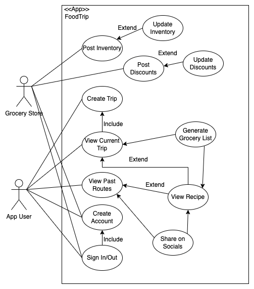

# M3 - Requirements and Design

## 1. Change History
<!-- Leave blank for M3 -->

## 2. Project Description
FoodTrip is an android app that helps users explore global cuisines by planning a virtual food trip. Users can choose a starting and ending country, and the app will generate a travel route with recipes from different locations along the way. It also creates a smart grocery list which can be used to optimize ingredient reuse and allow users to see local store discounts. Additionally, FoodTrip allows dietary preference customization and social media sharing, so users can tailor their meals to their needs and share their journeys with friends.


## 3. Requirements Specification
### **3.1. Use-Case Diagram**



### **3.2. Actors Description**
1. **Application User**: An actor who interacts with the app to create food trips, manage grocery lists, and share their journey on social media. Users can set dietary preferences and explore different cuisines.
2. **Grocery Store**: An actor that can provide information about item availability, offer discounts, and notify users of out-of-stock ingredients.


### **3.3. Functional Requirements**
<a name="fr1"></a>

1. **Manage food trip** 
    - **Overview**:
        1. Select a starting country and an ending country.
        2. Set the number of locations to explore.
        3. Set dietary preferences and restrictions.
        4. Generate a travel route with associated recipes.
    
    - **Detailed Flow for Each Independent Scenario**: 
        1. **Creating a food trip**:
            - **Description**: The user inputs a start and end country, along with preferences.
            - **Primary actor(s)**: App user.
            - **Main success scenario**:
                1. User selects starting and ending countries.
                2. User sets the number of location and dietary preferences.
                3. The app generates a realistic route with recipes from each country.
                4. The trip is displayed on a map with recipe pins.
            - **Failure scenario(s)**:
                - 1a. No valid route exists.
                    - 1a1. Notify user and suggest other options.
                - 1b. No recipes match the dietary restrictions.
                    - 1b1. Ask user to relax restrictions or modify selection.
    
2. **Manage Grocery List** 
    - **Overview**:
        1. Generate a list of required ingredients for the trip.
        2. Optimize for ingredient reuse to reduce costs.
        3. Display available discounts from partner grocery stores.
        4. Let users know about out-of-stock items and offer other options.
    
    - **Detailed Flow for Each Independent Scenario**: 
        1. **Generating a Grocery List**:
            - **Description**: The app creates a shopping list based on recipes.
            - **Primary actor(s)**: App user and grocery store.
            - **Main success scenario**:
                1. The app finds required ingredients from selected recipes.
                2. It checks for reusable ingredients across multiple recipes.
                3. The grocery list is created and shown to the user.
            - **Failure scenario(s)**:
                - 1a. Some ingredients are not available.
                    - 1a1. Let user know and suggest replacement options.

3. **Share on Social Media** 
    - **Overview**:
        1. Users can share their food trip and recipes.
        2. View other users' trips.
    
    - **Detailed Flow for Each Independent Scenario**: 
        1. **Sharing a Trip**:
            - **Description**: Users post their completed food trips on social media.
            - **Primary actor(s)**: App user. 
            - **Main success scenario**:
                1. User selects a completed trip.
                2. The app generates a post with trip details and photos.
                3. User shares on selected platforms (Facebook, Instagram, etc.).
            - **Failure scenario(s)**:
                - 1a. No internet connection.
                    - 1a1. Let user know and allow retry later.


### **3.4. Screen Mockups**
Not necessary to explain our requirements.


### **3.5. Non-Functional Requirements**
<a name="nfr1"></a>

1. **Efficient performance**
    - **Description**: The system should generate food trips and grocery lists in under 10 seconds.
    - **Justification**: Helps to ensure a good user experience without long loading times.
2. **Security and privacy**
    - **Description**: User data such as dietary preferences and grocery lists should be securely stored and only accessible from an authenticated account.
    - **Justification**: Helps build user trust and ensures data protection.


## 4. Designs Specification
### **4.1. Main Components**
1. **[Virtual Route Manager]**
    - **Purpose**: Manages the virtual trip by allowing it to convert the coordinates given into a list of recipes which are returned to the user. Designed to handle all the logic and API calls required to create a virtual trip
    - **Interfaces**: 
        1. Convert_Virtual_Trip
            - **Purpose**: Converts a pair of coordinates into a list of recipes that would be found if geographically travelling between the two points
            - **Input**: firstpoint, The starting location of the virtual trip
                        secondpoint, The end location of the virtual trip
                        stops_per_country, the number of dishes to select per country
                         dietary_restrictions, a list of ingredients to avoid
            - **Return**: viableroutes, a list of routes that could be taken between the two points
                        recipes, a list of recipes corresponding to a viableroute
        2. find_route
            - **Purpose**: finds a route using GoogleMaps API between a pair or points
            - **Input**: firstpoint, The starting location of the virtual trip
                        secondpoint, The end location of the virtual trip
            - **Output**: route, a sequence of coordinates as specified by the polyline class in the GoogleMaps API documentation
        3. find_countries_from_route
            - **Purpose**: Determine which countries are passed through the two points for a given route
            - **Input**: route
            - **Output**:countries, a list of countries that are associated with said path
        4. find_recipes_for_country
            - **Purpose**: Looks up recipes using Edamam API for the given countries on the route. Recipes should only be selected if the location they are associated with is within the relevance distance of the route
            - **Input**: route,
                         countries,
                         relevance_distance, the maximum euclidean distance between the region associated with a selected recipe and the route
            - **Output**: potential_recipes, a list of all recipes within relevance distance, including recipes that may violate dietary restrictions
        5. remove_violating_recipes
            - **Purpose**: remove any recipes from the list of potential recipes if they violate the users' dietary preferences
            - **Input**: potential_recipes, a list of all recipes within relevance distance, including recipes that may violate dietary restrictions
                        dietary_restrictions, a list of ingredients to avoid
            - **Output**: none, edits the list of potential recipes directly
        6. select_recipes
            - **Purpose**: select a final list of recipes for a given route
            - **Input**: potential_recipes, a list of all recipes that are suitable to be used for a given route
                        countries, a list of countries that are passed through the route
                        stops_per_country, the maximum number of recipes that a single country can have
                        subcultures_per_country, a multiplier to the number of recipes that a given country can have. For a given subculture, it cannot have more than stops_per_country recipes selected
            - **Output**: selected_recipes, the final list of recipes for this route. the total number of recipes cannot exceed countries * stops_per_country * subcultures_per_country
2. **[Grocery Manager]**
    - **Purpose**: 
    - **Interfaces**: 
        1. Optimize_reuse
            - **Purpose**: Attempt to alter recipes to maximize ingredient reuse betweeen recipes
            - **Input**: recipes, the list of selected recipes for a virtual trip
                        groceries, the list of groceries required for the selected recipes
            - **Output**: status, indicating whether or not any ingredients were changed
                        changes, a list of ingredients that were altered, if any
        2. Generate_grocery_trip
            - **Purpose**: Creates a route to local grocery stores using GoogleMaps API.
            - **Input**: userlocation, the users' location, which should be the start and end point
                        groceries, the list of ingredients required for the selected recipes
            - **Output**: GroceryTrip, a sequence of coordinates as specified by the polyline class in the GoogleMaps API documentation
        3. Add_ingredient
            - **Purpose**: AJAX PUT request to add an ingredient to a shopping list
            - **Input**: ingredient, the name of the ingredient to add
                        number, the amount of the ingredient to add
            - **Output**: status, whether or not the operation succeeded
        4. Remove_Ingredient
            - **Purpose**: AJAX DELETE request to remove an ingredient from a shopping list
            - **Input**: ingredient, the name of the ingredient to remove
                        number, the amount of the ingredient to remove
            - **Output**: status, whether or not the operation succeeded
        5. Change_quantity
            - **Purpose**: An AJAX PUT request to change the quantity of an ingredient 
            - **Input**: ingredient, the name of the ingredient to remove
                        number, the amount of the ingredient to remove
            - **Output**: status, whether or not the operation succeeded
3. **[Frontend]**
    - **Purpose**: Allows users to interact with all other components. Users should be able to select important information such as starting and end points for virtual trips, as well as which trip they may want to share on social media
    - **Interfaces**: 
        1. Begin Virtual Trip
            - **Purpose**: Allows the user to begin planning a virtual trip
            - **Input**: A Google Maps interface and popup to enter virtual trip settings and dietary preferences
            - **Output**: A sequence of routes and the list of recipes associated with those routes
        2. Share_Trip
            - **Purpose**: Allows users to create a social media post using Meta API and their list of trips from the Trips database
            - **Input**: An interface asking which social media platform the user would like to post to, as well as which of their virtual trips they would like to post
            - **Output**: Redirect to login of the platform of choice, which would then lead to the "create post" interface for that given platform 
        3. Manage_Grocery_Trip
            - **Purpose**: Allows the user to use Google Maps API to plan a trip to local grocery stores to guy ingredients 
            - **Input**: Asks for location permissions if they are not already given. An interface selecting which grocery list the user would like to plan a trip for. 
            - **Output**: A Google Maps route starting at the users' location and passing through local grocery stores. The user has a button to generate a different route if needed
        4. Manage_Grocery_List
            - **Purpose**: Allows the user to issue AJAX requests to change the ingredients on a given grocery list, retrieved and updating the groceries database
            - **Input**: A screen displaying a list of ingredients and their quantity, with buttons to adjust the quantity, add or remove ingredients
            - **Output**: Whether or not a given operation was successful

### **4.2. Databases**
1. **[Trips]**
    - **Purpose**: Stores all trips for a given user and the recipes used in that trip
2. **[Groceries]**
    - **Purpose**: Stores all grocery lists for a given user

### **4.3. External Modules**
1. **[Edamam API]** 
    - **Purpose**: Used to lookup recipes. Chosen for its ability to lookup 2.3 million recipes and 30 day free trial, as well as being utilized in other similar use cases requiring recipe lookup
2. **[Google Maps]** 
    - **Purpose**: Used for creating virtual trips and planning local grocery trips. Chosen for its popularity and abundant support/documentation
3. **[Meta API]** 
    - **Purpose**: Used to share recipes used in a virtual trip, the route taken in a virtual trip, or pictures of the food that users have made to a Meta platform(Facebook, Instagram, WhatsApp, etc.)


### **4.4. Frameworks**
1. **AWS**
    - **Purpose**: EC2 Instance
    - **Reason**: All team members have prior experience with AWS from M1. We are also familiar with setting up CI/CD pipelines using GitHub Actions to automatically deploy the backend whenever changes are made to the main branch.
2. **MongoDB**
    - **Purpose**: User Database
    - **Reason**: All team members have experience working with MongoDB, and it is an approved framework for the project. We also have hands-on experience from tutorials on setting up the database and integrating it with our backend.
3. **Node.js & Express**
    - **Purpose**: Backend API
    - **Reason**: All members are familiar with it, and it meets the project requirements. It also integrates well with MongoDB.


### **4.5. Dependencies Diagram**


### **4.6. Functional Requirements Sequence Diagram**
1. [**[WRITE_NAME_HERE]**](#fr1)\
[SEQUENCE_DIAGRAM_HERE](images/sequenceManageTrip.png)
2. ...


### **4.7. Non-Functional Requirements Design**
1. [**[WRITE_NAME_HERE]**](#nfr1)
    - **Validation**: ...
2. ...


### **4.8. Main Project Complexity Design**
**[Convert_Virtual_Trip]**
- **Description**: Converts a virtual trip from google maps into a list of ingredients. Formally, it takes a pair of coordinates and finds a combination of transportation methods between those points via google maps. Must be able to associate the path travelled to certain ethnic foods, then search for recipes for said food through edamam API, finally returning a series of recipes that an individual may reasonably find if they were to actually travel between the two inputs points. A dish would be considered reasonable if the region associated with it is within a certain distance of a virtual path between the points as given by google maps. The user may specify dietary restrictions and the number of subcultures within a given country, which would be relevant as it may arbitrarily restrict the recipes that are associated with the selected virtual path
- **Why complex?**: Since users are expected to travel across multiple countries, many different paths could be taken depending on the forms of transportation available, meaning that there are many different viable virtual paths. For any given virtual path, the algorithm must be able to determine what recipes are associated with that path, and then find a combination of recipes that satisfies the number of dishes per country whilst obeying user dietary restrictions
- **Design**:
    - **Input**: firstpoint, The starting location of the virtual trip
                secondpoint, The end location of the virtual trip
                stops_per_country, the number of dishes to select per country
                 dietary_restrictions, a list of ingredients to avoid
    - **Output**: a list of recipes associated with the virtual path between input points
    - **Main computational logic**: ...
    - **Pseudo-code**: ...
        ```
        attempted_paths = 0
        viable_routes = []
        recipes = []
        countries = []
        while (attemptedpaths < attempt_limit) // to prevent insane delays from trying every possible path
            route = find_route(firstpoint, secondpoint)
            countries = find_countries_from_route(route)
            for country in countries
                potential_recipes = find_recipes_for_country(route,country,relevance_distance)
                remove_violating_recipes(potential_recipes, dietary_restrictions)
                if potential_recipes.length < stops_per_country
                    continue // try another path
                selected_recipes = select_recipes(potential_recipes, stops_per_country, subcultures_per_country)
                recipes.add(selected_recipes)
                viable_routes.add(route)
            attemptedpaths++
        return(recipes,viable_routes)
        ```


## 5. Contributions
- ...
- ...
- ...
- ...
