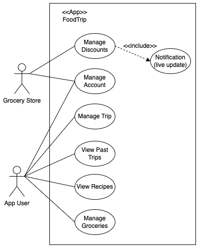
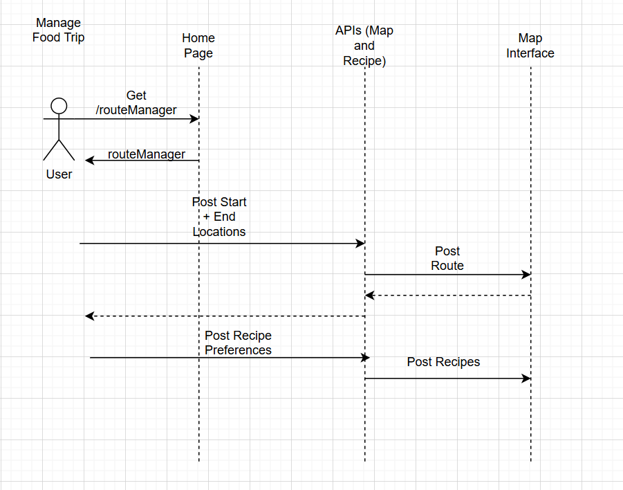
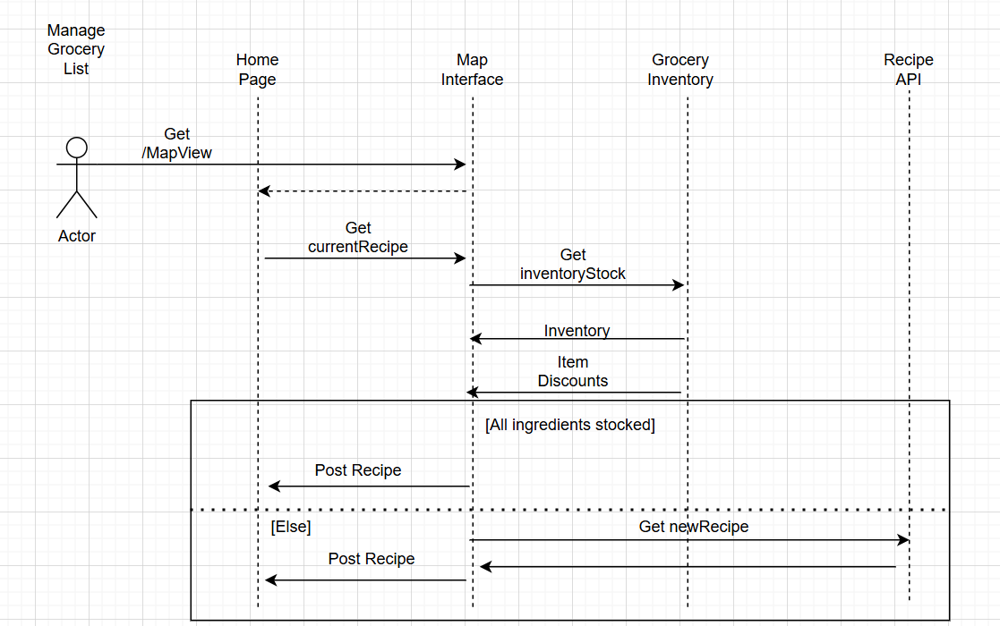
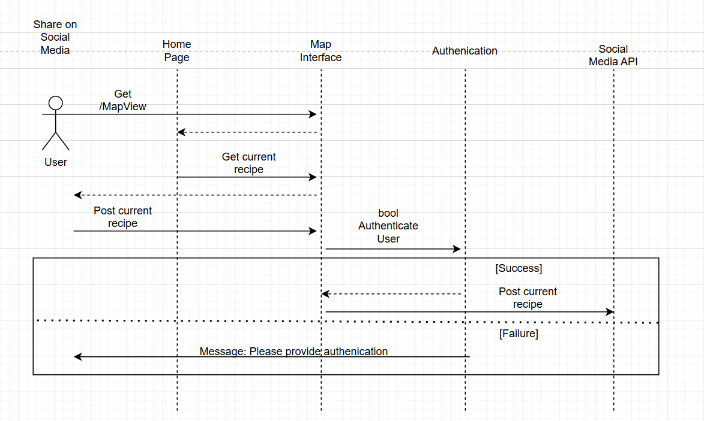

# M3 - Requirements and Design

## 1. Change History
**M4:**
- February 12, 2025: We modified our use cases to the following: Manage Trip, View Past Trips, View Recipes, View Groceries, Manage Account and Manage Discounts. The updated use-case diagram is:  
  
The reason for changing our diagram is based on comments from our M3. We also removed the "Share on Social Media" use case for the MVP since we didn’t think we would have enough time, however, we will try to add this functionality in the final version of the app.
- February 12, 2025: Based on feedback from our M3, we added live updates through push notifications with Firebase. Every time a new discount is pushed by a grocery store, users subscribed to discount updates will receive a push notification about the discount.
- February 26, 2025: Another change was made to the preferences option for "Manage Trip." This feature has been de-scoped for the MVP, so it is not included, however, we will try to add this functionality in the final version of the app.
- February 27, 2025: Several changes were made to the databases. The new databases we now have are: geonames, route_data, food_data and discounts. The purpose of the geonames database is to store all cities with a population greater than 15,000 people in order to generate routes to these cities. We switched to this approach instead of using an API, as the API was unreliable and the server was often down. We also decided to remove the users database since we de-scoped preferences. It seemed better to separate routes and recipes for portability. Additionally, we got rid of the groceries database and now use the recipes database for ingredients.
**M5:**
- March 16, 2025
    - Section 2: added more clarity of virtual trips and removed descoped features(social media)
    - Section 3.1: Updated use case diagram to more accurately reflect relationships between use cases (View Recipes must use View Past Trips, Manage Groceries must use View Recipes.)
    - Section 3.2:

## 2. Project Description
FoodTrip is an android app that helps users explore global cuisines by planning a virtual food trip. Users can choose a starting and ending country, and the app will generate a travel route with recipes from different locations along the way. It also creates a smart grocery list which can be used to optimize ingredient reuse and allow users to see local store discounts. Additionally, FoodTrip allows dietary preference customization and social media sharing, so users can tailor their meals to their needs and share their journeys with friends.


## 3. Requirements Specification
### **3.1. Use-Case Diagram**


### **3.2. Actors Description**
1. **Grocery Store**: An actor who can manage discounts available to customers .
2. **App User**: An actor who interacts with the app to set their food preferences, manage virtual food trips, view their past trips, view their recipes, and manage their groceries.


### **3.3. Functional Requirements**
<a name="fr1"></a>

1. **Manage Discounts** 
    - **Overview**:
        1. Grocery store owners may upload discounts, notifying users in real time. creating a discount requires:
            - storeID, 
            - storeName,
            - ingredient,
            - price,
        3. Owners may delete discounts by discountID, which is created when discounts are added
    
    - **Detailed Flow for Each Independent Scenario**: 
        1. **Upload Discount**
            - **Description**: Grocery store owners can add a discount
            - **Primary actor(s)**: Grocery store owners (admin)
            - **Preconditions**: None
            - **Postconditions**: Ingredient corresponding to the actors store is now displayed as discounted for all users
            - **Main success scenario**:
                1. "Manage Discounts" is selected from the main menu
                2. System displays entries for storeID, storeName, ingredient, and price of the discount to be added
                3. Owners input all fields and submits the discount
                4. The discount is added, and all users are notified in real time
            - **Failure scenario(s)**:
                - 3a. Owner attempts to post a discount with a missing parameter
                    - 3a1. The app shows an pop-up message prompting the owner to fill all input fields
                - 3b. Owner attempt to post a discount with $0 or lower price
                    - 3b1. The app shows an pop-up message prompting the user for a valid price input
                - 4a. Discount could not be added due to connection errors
                    - 4c1. The app shows an pop-up message to tell user try again later
                - 4b. Users could not be notified
                    - 4c1. The app shows an pop-up message notifying that users could not be notified
        2. **Delete Discount**
            - **Description**: User can delete a posted discount
            - **Primary actor(s)**: Grocery store owners (admin)
            - **Preconditions**: Item exists in stores discount list
            - **Postconditions**: Ingredient corresponding to the actors store is now deleted for all users
            - **Main success scenario**:
                1. User selects a posted discount on the list and presses the delete button
                2. The app refreshes and the selected discount is removed from the list
            - **Failure scenario(s)**:
                - 1a. User attempts to perform a delete without selecting any discount
                    - 1a1. The app shows an pop-up message prompting the user to select a discount to be deleted
                - 1b. No internet connection
                    - 1b1. The app shows an pop-up message to tell user try again later
    
2. **Set Preferences** 
    - **Overview**:
        1. Users set "preferences" from the main menu
        2. App lets user enter their allergies and allows the option to turn on real-time notifications
        3. Users are able to individually change allergies and notification settings
        4. Users may choose to update their preferences or discard any changes
    
    - **Detailed Flow for Each Independent Scenario**: 
        1. **Set Allergies**:
            - **Description**: User sets their allergies
            - **Primary actor(s)**: App user
            - **Preconditions**: None
            - **Postconditions**: Users allergy settings are stored on backend
            - **Main success scenario**:
                1. "Set Preferences" is selected from the main menu
                2. System displays the option to set allergies or to toggle notifications
                3. User selects "Set Allergies"
                4. User is given the option to select from multiple common allergies or submit their own
                5. User presses confirmation button and is returned to set preferences page
            - **Failure scenario(s)**:
                - 5a. Unable to save allergy
                    - 5a1. The app shows an pop-up message telling the user their allergy settins could not be saved
        2. **Allow Notification Settings**:
            - **Description**: User allows the app to send them notifications
            - **Primary actor(s)**: App User
            - **Preconditions**: Notifications are disallowed for the user
            - **Postconditions**: Notifications are allowed for the user
            - **Main success scenario**:
                1. "Set Preferences" is selected from the main menu
                2. System displays the option to set allergies or to toggle notifications
                3. User toggles notifications to allow
            - **Failure scenario(s)**:
                - 3a. Unable to set notification settings
                    - 3a1. The app shows an pop-up message telling the user notification settings failed to update and prompts them to try again
        3. **Disable Notification Settings**:
            - **Description**: User disallows the app to send them notifications
            - **Primary actor(s)**: App User
            - **Preconditions**: Notifications are allowed for the user
            - **Postconditions**: Notifications are disallowed for the user
            - **Main success scenario**:
                1. "Set Preferences" is selected from the main menu
                2. System displays the option to set allergies or to toggle notifications
                3. User toggles notifications to not allowed
            - **Failure scenario(s)**:
                - 3a. Unable to set notification settings
                    - 3a1. The app shows an pop-up message telling the user notification settings failed to update and prompts them to try again
                 

3. **Manage trip** 
    - **Overview**:
        1. Select a starting country and an ending city.
        2. Set the number of locations to explore.
        3. Generate a virtual travel route with associated recipes.
    
    - **Detailed Flow for Each Independent Scenario**: 
        1. **Creating a food trip**:
            - **Description**: The user inputs a start and end country, along with preferences.
            - **Primary actor(s)**: App user
            - **Preconditions**: None
            - **Postconditions**: Created trip is now stored in trip database under the user
            - **Main success scenario**:
                1. User enters starting and ending cities.
                2. User sets the number of stops
                3. The app opens the Main Screen
                4. The trip is displayed on a map
            - **Failure scenario(s)**:
                - 1a. The user enters an invalid start/end city and attempts to create a trip
                    - 1a1. The app displays a pop-up message saying that the associated field is invalid
                - 1b. The user doesn't enter a input into any one of the text inputs and attempts to create a trip
                    - 1b1. The app displays a pop-up message saying that the associated field is missing
                - 1c. The user enters the same city in the start and end fields and attempts to create a trip
                    - 1c1. The app displays a pop-up message saying that there can't be the same start and end city
                - 2a. The user enters 0 as the number of stops
                    - 2a1. The app displays a pop-up message saying that the number of stops is invalid 
                 

4. **View Past Trips** 
    - **Overview**:
        1. Users can view the past trips they have created.
    
    - **Detailed Flow for Each Independent Scenario**: 
        1. **View Past Trip**:
            - **Description**: User views their past trips and the corresponding map view and recipes
            - **Primary actor(s)**: App user
            - **Preconditions**: User has created at least 1 trip already
            - **Postconditions**: None
            - **Main success scenario**:
                1. User open the Past Trip View
                2. The app shows a list of past trip have been created
                3. User presses one of the trips in the list
                4. The window shows the starting location, intermediate stops, destination, recipes for each stop, and a "Show Route" button.
                5. The user presses the "Show Route" button
                6. The user clicks on the first recipe
              **Extension(s):**
                - 5a. The user is directed to the main page and a map of the route is displayed
                - 6a. The window shows the details of the recipe and a recipe url
                    - 6a1. The user clicks the recipe url.
                    - 6a2. A webView shows up.
            - **Failure scenario(s)**:
                - 2a. User has no past trip record
                    - 2a1. The app shows no items in the list
                - 2b. No internet connection
                    - 2b1. The app displays an error message: "No internet connection"

5. **View Recipes** 
    - **Overview**:
        1. Users can view the recipes that correspond to a virtual trip
    
    - **Detailed Flow for Each Independent Scenario**: 
        1. **Viewing A Recipe**:
            - **Description**: The user chooses a recipe linked to their selected trip and sees the recipe details
            - **Primary actor(s)**: App user
            - **Preconditions**: User has a currently selected trip
            - **Postconditions**: None
            - **Main success scenario**:
                1. User opens the Recipes view
                2. The app displays a list of stops (cities) associated with the currently selected trip
                3. User clicks a stop to get a recipe
                4. The app displays the details of the recipe an a recipe url
                5. User clicked on the url
                6. The app displays a webview of the recipe 
            - **Failure scenario(s)**:
                - 1a. No trips have been taken
                    - 1a1. The app displays an pop-up message: "Must have virtual trip to view recipes"
                    - 1a2. Users are redirected to the "Manage Trip" menu
                - 2a. Trips cannot be retrieved
                    - 1a1. The app displays an pop-up message: "Cannot access trips right now, please try again later"
                - 3a. Recipes cannot be retrieved
                    - 3a1. The app displays an pop-up message: "Cannot access recipes right now, please try again later"

6. **Manage Groceries** 
    - **Overview**:
        1. Generate a list of required ingredients for the trip.
        2. Optimize for ingredient reuse to reduce costs.
        3. Display available discounts from partner grocery stores.
        4. Let users know about out-of-stock items and offer other options.
    
    - **Detailed Flow for Each Independent Scenario**: 
        1. **Generating a Grocery List**:
            - **Description**: The app creates a shopping list based on recipes.
            - **Primary actor(s)**: App user
            - **Preconditions**: User has a currently selected trip
            - **Postconditions**: None
            - **Main success scenario**:
                1. The app finds required ingredients from all recipes corresponding to a virtual trip.
                2. It checks for reusable ingredients across multiple recipes.
                3. The grocery list is created and shown to the user.
                4. All ingredients are checked against available discounts
                5. Any discounts found are displayed to the user
            - **Failure scenario(s)**:
                - 1a. Some ingredients are not available.
                    - 1a1. Let user know and suggest replacement options.

### **3.4. Screen Mockups**
Not necessary to explain our requirements.


### **3.5. Non-Functional Requirements**
<a name="nfr1"></a>

1. **Efficient performance**
    - **Description**: The system should generate food trips and grocery lists in under 10 seconds.
    - **Justification**: Helps to ensure a good user experience without long loading times.
2. **Scalability**
    - **Description**: User data should be stored and retrieved efficiently, scaling up to 50 recipes for up to 50000 users  
    - **Justification**: Since users are sharing to social media, being able to store large quantities of data for potentially tens of thousands of clients may be required. 


## 4. Designs Specification
### **4.1. Main Components**
1. **[Virtual Route Manager]**
    - **Purpose**: Manages the virtual trip by allowing it to convert the coordinates given into a list of recipes which are returned to the user. Designed to handle all the logic and API calls required to create a virtual trip
    - **Interfaces**: 
        1. Convert_Virtual_Trip
            - **Purpose**: Converts a pair of coordinates into a list of recipes that would be found if geographically travelling between the two points
            - **Input**: firstpoint, The starting location of the virtual trip
                        secondpoint, The end location of the virtual trip
                        stops_per_country, the number of dishes to select per country
                         dietary_restrictions, a list of ingredients to avoid
            - **Return**: viableroutes, a list of routes that could be taken between the two points
                        recipes, a list of recipes corresponding to a viableroute
        2. find_route
            - **Purpose**: finds a route using GoogleMaps API between a pair or points
            - **Input**: firstpoint, The starting location of the virtual trip
                        secondpoint, The end location of the virtual trip
            - **Output**: route, a sequence of coordinates as specified by the polyline class in the GoogleMaps API documentation
        3. find_countries_from_route
            - **Purpose**: Determine which countries are passed through the two points for a given route
            - **Input**: route
            - **Output**:countries, a list of countries that are associated with said path
        4. find_recipes_for_country
            - **Purpose**: Looks up recipes using Edamam API for the given countries on the route. Recipes should only be selected if the location they are associated with is within the relevance distance of the route
            - **Input**: route,
                         countries,
                         relevance_distance, the maximum euclidean distance between the region associated with a selected recipe and the route
            - **Output**: potential_recipes, a list of all recipes within relevance distance, including recipes that may violate dietary restrictions
        5. remove_violating_recipes
            - **Purpose**: remove any recipes from the list of potential recipes if they violate the users' dietary preferences
            - **Input**: potential_recipes, a list of all recipes within relevance distance, including recipes that may violate dietary restrictions
                        dietary_restrictions, a list of ingredients to avoid
            - **Output**: none, edits the list of potential recipes directly
        6. select_recipes
            - **Purpose**: select a final list of recipes for a given route
            - **Input**: potential_recipes, a list of all recipes that are suitable to be used for a given route
                        countries, a list of countries that are passed through the route
                        stops_per_country, the maximum number of recipes that a single country can have
                        subcultures_per_country, a multiplier to the number of recipes that a given country can have. For a given subculture, it cannot have more than stops_per_country recipes selected
            - **Output**: selected_recipes, the final list of recipes for this route. the total number of recipes cannot exceed countries * stops_per_country * subcultures_per_country
2. **[Grocery Manager]**
    - **Purpose**: 
    - **Interfaces**: 
        1. Optimize_reuse
            - **Purpose**: Attempt to alter recipes to maximize ingredient reuse betweeen recipes
            - **Input**: recipes, the list of selected recipes for a virtual trip
                        groceries, the list of groceries required for the selected recipes
            - **Output**: status, indicating whether or not any ingredients were changed
                        changes, a list of ingredients that were altered, if any
        2. Generate_grocery_trip
            - **Purpose**: Creates a route to local grocery stores using GoogleMaps API.
            - **Input**: userlocation, the users' location, which should be the start and end point
                        groceries, the list of ingredients required for the selected recipes
            - **Output**: GroceryTrip, a sequence of coordinates as specified by the polyline class in the GoogleMaps API documentation
        3. Add_ingredient
            - **Purpose**: AJAX PUT request to add an ingredient to a shopping list
            - **Input**: ingredient, the name of the ingredient to add
                        number, the amount of the ingredient to add
            - **Output**: status, whether or not the operation succeeded
        4. Remove_Ingredient
            - **Purpose**: AJAX DELETE request to remove an ingredient from a shopping list
            - **Input**: ingredient, the name of the ingredient to remove
                        number, the amount of the ingredient to remove
            - **Output**: status, whether or not the operation succeeded
        5. Change_quantity
            - **Purpose**: An AJAX PUT request to change the quantity of an ingredient 
            - **Input**: ingredient, the name of the ingredient to remove
                        number, the amount of the ingredient to remove
            - **Output**: status, whether or not the operation succeeded
3. **[Frontend]**
    - **Purpose**: Allows users to interact with all other components. Users should be able to select important information such as starting and end points for virtual trips, as well as which trip they may want to share on social media
    - **Interfaces**: 
        1. Begin Virtual Trip
            - **Purpose**: Allows the user to begin planning a virtual trip
            - **Input**: A Google Maps interface and popup to enter virtual trip settings and dietary preferences
            - **Output**: A sequence of routes and the list of recipes associated with those routes
        2. Share_Trip
            - **Purpose**: Allows users to create a social media post using Meta API and their list of trips from the Trips database
            - **Input**: An interface asking which social media platform the user would like to post to, as well as which of their virtual trips they would like to post
            - **Output**: Redirect to login of the platform of choice, which would then lead to the "create post" interface for that given platform 
        3. Manage_Grocery_Trip
            - **Purpose**: Allows the user to use Google Maps API to plan a trip to local grocery stores to guy ingredients 
            - **Input**: Asks for location permissions if they are not already given. An interface selecting which grocery list the user would like to plan a trip for. 
            - **Output**: A Google Maps route starting at the users' location and passing through local grocery stores. The user has a button to generate a different route if needed
        4. Manage_Grocery_List
            - **Purpose**: Allows the user to issue AJAX requests to change the ingredients on a given grocery list, retrieved and updating the groceries database
            - **Input**: A screen displaying a list of ingredients and their quantity, with buttons to adjust the quantity, add or remove ingredients
            - **Output**: Whether or not a given operation was successful

### **4.2. Databases**
1. **[Users]**
    - **Purpose**: Stores user account information, including authentication details, dietary preferences, saved trips, and any personalized settings
2. **[Trips]**
    - **Purpose**: Stores all trips for a given user and the recipes used in that trip
3. **[Groceries]**
    - **Purpose**: Stores all grocery lists for a given user

### **4.3. External Modules**
1. **[Edamam API]** 
    - **Purpose**: Used to lookup recipes. Chosen for its ability to lookup 2.3 million recipes and 30 day free trial, as well as being utilized in other similar use cases requiring recipe lookup
2. **[Google Maps]** 
    - **Purpose**: Used for creating virtual trips and planning local grocery trips. Chosen for its popularity and abundant support/documentation
3. **[Meta API]** 
    - **Purpose**: Used to share recipes used in a virtual trip, the route taken in a virtual trip, or pictures of the food that users have made to a Meta platform(Facebook, Instagram, WhatsApp, etc.)


### **4.4. Frameworks**
1. **AWS**
    - **Purpose**: EC2 Instance
    - **Reason**: All team members have prior experience with AWS from M1. We are also familiar with setting up CI/CD pipelines using GitHub Actions to automatically deploy the backend whenever changes are made to the main branch.
2. **MongoDB**
    - **Purpose**: Databases
    - **Reason**: All team members have experience working with MongoDB, and it is an approved framework for the project. We also have hands-on experience from tutorials on setting up the database and integrating it with our backend.
3. **Node.js & Express**
    - **Purpose**: Backend API
    - **Reason**: All members are familiar with it, and it meets the project requirements. It also integrates well with MongoDB.


### **4.5. Dependencies Diagram**


### **4.6. Functional Requirements Sequence Diagram**
1. [Manage Food Trip](#fr1)\

2. [Manage Grocery List](#fr2)\

3. [Sharing on Social Media](#fr3)\



### **4.7. Non-Functional Requirements Design**
1. [Efficient performance](#nfr1)
    - **Validation**: The system will use caching and asynchronous processing to improve response times. Frequently accessed data will be cached to reduce redundant computations, and background tasks will handle complex operations without blocking user interactions.
2. [Scalability](#nfr1)
    - **Cloud Computing**: The system will be hosted on AWS Cloud services and thus be able to dynamically scale to meet the needs of users. Recipes will be stored by name or ID on a MongoDB database, thus reducing their overall size from the entire recipe to just a list of strings, thus drastically reducing the size of recipes

### **4.8. Main Project Complexity Design**
**[Convert_Virtual_Trip]**
- **Description**: Converts a virtual trip from google maps into a list of ingredients. Formally, it takes a pair of coordinates and finds a combination of transportation methods between those points via google maps. Must be able to associate the path travelled to certain ethnic foods, then search for recipes for said food through edamam API, finally returning a series of recipes that an individual may reasonably find if they were to actually travel between the two inputs points. A dish would be considered reasonable if the region associated with it is within a certain distance of a virtual path between the points as given by google maps. The user may specify dietary restrictions and the number of subcultures within a given country, which would be relevant as it may arbitrarily restrict the recipes that are associated with the selected virtual path
- **Why complex?**: Since users are expected to travel across multiple countries, many different paths could be taken depending on the forms of transportation available, meaning that there are many different viable virtual paths. For any given virtual path, the algorithm must be able to determine what recipes are associated with that path, and then find a combination of recipes that satisfies the number of dishes per country whilst obeying user dietary restrictions
- **Design**:
    - **Input**: firstpoint, The starting location of the virtual trip
                secondpoint, The end location of the virtual trip
                stops_per_country, the number of dishes to select per country
                 dietary_restrictions, a list of ingredients to avoid
    - **Output**: a list of recipes associated with the virtual path between input points
    - **Main computational logic**: ...
    - **Pseudo-code**: ...
        ```
        attempted_paths = 0
        viable_routes = []
        recipes = []
        countries = []
        while (attemptedpaths < attempt_limit) // to prevent insane delays from trying every possible path
            route = find_route(firstpoint, secondpoint)
            countries = find_countries_from_route(route)
            for country in countries
                potential_recipes = find_recipes_for_country(route,country,relevance_distance)
                remove_violating_recipes(potential_recipes, dietary_restrictions)
                if potential_recipes.length < stops_per_country
                    continue // try another path
                selected_recipes = select_recipes(potential_recipes, stops_per_country, subcultures_per_country)
                recipes.add(selected_recipes)
                viable_routes.add(route)
            attemptedpaths++
        return(recipes,viable_routes)
        ```


## 5. Contributions
- Kenny Tang - Help review the details and the sequence diagrams. (Work Time: 3 hours)
- Eric Omielan - Wrote requirement specifications, project description, frameworks section, and databases section. Helped with reflections pdf. (Work time 10 hours)
- Rudy Ma - Made Use-case diagram, sequence diagrams, and dependency diagrams according to the project design and requirements. Made Reflections pdf. (Work Time: 5 hours)
- Evan Lai - Work Time: 3.5.2, 4.1, 4.2, 4.3, 4.7.2, 4.8 . 13 hours
