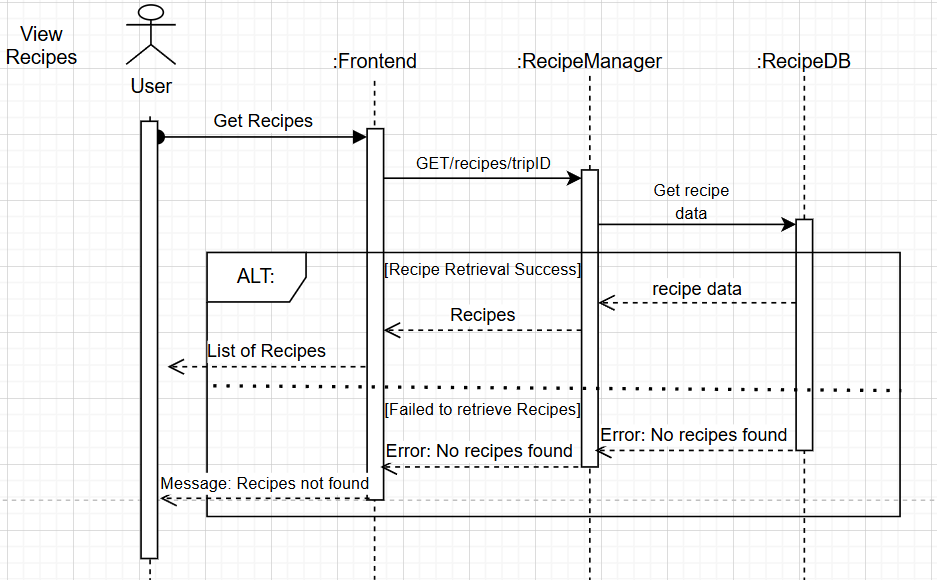
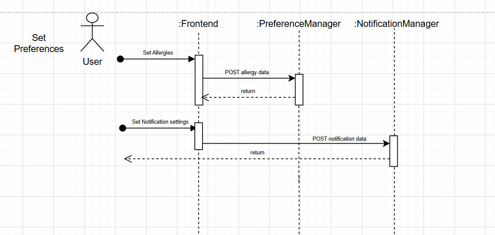
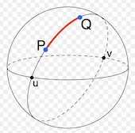
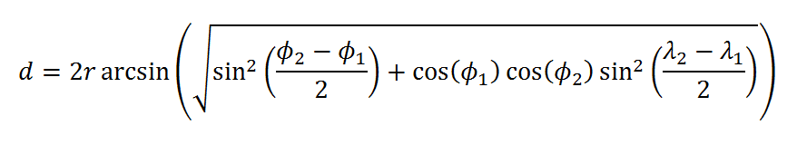

# M3 - Requirements and Design

## 1. Change History
**M4:**
- February 12, 2025: We modified our use cases to the following: Manage Trip, View Past Trips, View Recipes, View Groceries, Manage Account and Manage Discounts.
The reason for changing our diagram is based on comments from our M3. We also removed the "Share on Social Media" use case for the MVP since we didn’t think we would have enough time, however, we will try to add this functionality in the final version of the app.
- February 12, 2025: Based on feedback from our M3, we added live updates through push notifications with Firebase. Every time a new discount is pushed by a grocery store, users subscribed to discount updates will receive a push notification about the discount.
- February 26, 2025: Another change was made to the preferences option for "Manage Trip." This feature has been de-scoped for the MVP, so it is not included, however, we will try to add this functionality in the final version of the app.
- February 27, 2025: Several changes were made to the databases. The new databases we now have are: geonames, route_data, food_data and discounts. The purpose of the geonames database is to store all cities with a population greater than 15,000 people in order to generate routes to these cities. We switched to this approach instead of using an API, as the API was unreliable and the server was often down. We also decided to remove the users database since we de-scoped preferences. It seemed better to separate routes and recipes for portability. Additionally, we got rid of the groceries database and now use the recipes database for ingredients.

**M5:**
- March 16, 2025
    - Section 2: added more clarity of virtual trips and removed descoped features(social media)
    - Section 3.1: Updated use case diagram to more accurately reflect relationships between use cases (View Recipes must use View Past Trips, Manage Groceries must use View Recipes.)
    - Section 3.2: Updated actor to better reflect new usecases
    - Section 3.3: Updated functional requirements to provide more details into success and failure scenarios as well as account for modified use cases
    - Section 3.5: Updated non-functional requirements to better fit the needs of our app and what is feasible
    - Section 4.1: Updated main components to account for use case changes and made function interfaces clearer
    - Section 4.2: Updated databases to fit the changed use cases
    - Section 4.3: Updated external modules to describe ones that provided the nessecary components needed to fulfill use cases
    - Section 4.4: Likewise updated frameworks to reflect changes in use cases
    - Section 4.6: Updated sequence diagrams to reflect every main use case and to follow REST call structure
    - Section 4.7: Updated to reflect non-functional requirement changes
- March 21, 2025
    - These updates happened after the mutual handoff, and thus should not be considered if referenced by code review
    - Section 3.5: After discussion with instructors, updates sources and added brief explanations after each source
    - Section 4.7: Updated description of Non-Functional Requirements testing to accurately reflect the tests performed
    - Section 4.8: Updated main complexity description and pseudocode to reflect expected functionality for final release
    - Section 2: Updated project description to match the scope of the functional requirements.

**M6:**
- March 30, 2025: Section 3.5: Use 3 seconds as the required response times to match test implementation.
- April 2, 2025:
    - Section 4.2 with new sequence diagrams for manage discounts and set preferences to match implementation.
    - Section 3.5: Use 2 seconds as the required response time to match test and provide source justifying.
    - Section 3.1: Invert arrow between "View Past Trips" and "View Recipes" to reflect implementation change.
    - Section 4.7: Update description to match test implementation.
    - Section 4.8: Update main complexity to match implementation and add images.


## 2. Project Description
FoodTrip is an Android app that helps users explore global cuisines by planning a virtual food trip. Users can choose a starting and ending location, and the app will generate a travel route with recipes from different locations along the way. It also creates a grocery list that compiles ingredients from all recipes, making it easier for users to shop, and displays available discounts for the ingredients. Additionally, users can set preferences such as allergies and subscribe to notifications about new discounts as soon as they are posted.


## 3. Requirements Specification
### **3.1. Use-Case Diagram**


### **3.2. Actors Description**
1. **Grocery Store**: An actor who can manage discounts available to customers.
2. **App User**: An actor who interacts with the app to set their food preferences, manage virtual food trips, view their past trips, view their recipes, and manage their groceries.


### **3.3. Functional Requirements**
<a name="fr1"></a>

1. **Manage Discounts**
    - **Overview**:
        1. Grocery store owners may upload discounts, notifying users in real time. creating a discount requires:
            - storeID,
            - storeName,
            - ingredient,
            - price,
        3. Owners may delete discounts by discountID, which is created when discounts are added

    - **Detailed Flow for Each Independent Scenario**:
        1. **Upload Discount**
            - **Description**: Grocery store owners can add a discount
            - **Primary actor(s)**: Grocery store owners (admin)
            - **Preconditions**: None
            - **Postconditions**: Ingredient corresponding to the actors store is now displayed as discounted for all users
            - **Main success scenario**: <br/>
                &nbsp;1\. "Manage Discounts" is selected from the main menu<br/>
                &nbsp;2\. System displays entries for storeID, storeName, ingredient, and price of the discount to be added<br/>
                &nbsp;3\. Owners input all fields and submits the discount<br/>
                &nbsp;4\. The discount is added, and all users are notified in real time
            - **Failure scenario(s)**:
                - 3a. Owner attempts to post a discount with a missing parameter
                    - 3a1. The app shows an pop-up message prompting the owner to fill all input fields
                - 3b. Owner attempt to post a discount with $0 or lower price
                    - 3b1. The app shows an pop-up message prompting the user for a valid price input
                - 4a. Discount could not be added due to connection errors
                    - 4c1. The app shows an pop-up message to tell user try again later
                - 4b. Users could not be notified
                    - 4c1. The app shows an pop-up message notifying that users could not be notified
        2. **Delete Discount**
            - **Description**: User can delete a posted discount
            - **Primary actor(s)**: Grocery store owners (admin)
            - **Preconditions**: Item exists in stores discount list
            - **Postconditions**: Ingredient corresponding to the actors store is now deleted for all users
            - **Main success scenario**:<br/>
                &nbsp;1\. User selects a posted discount on the list and presses the delete button<br/>
                &nbsp;2\. The app refreshes and the selected discount is removed from the list
            - **Failure scenario(s)**:
                - 1a. User attempts to perform a delete without selecting any discount
                    - 1a1. The app shows an pop-up message prompting the user to select a discount to be deleted
                - 1b. No internet connection
                    - 1b1. The app shows an pop-up message to tell user try again later

2. **Set Preferences**
    - **Overview**:
        1. Users set "preferences" from the main menu
        2. App lets user enter their allergies and allows the option to turn on real-time notifications
        3. Users are able to individually change allergies and notification settings
        4. Users may choose to update their preferences or discard any changes

    - **Detailed Flow for Each Independent Scenario**:
        1. **Set Allergies**:
            - **Description**: User sets their allergies
            - **Primary actor(s)**: App user
            - **Preconditions**: None
            - **Postconditions**: Users allergy settings are stored on backend
            - **Main success scenario**:<br/>
                &nbsp;1\. "Set Preferences" is selected from the main menu<br/>
                &nbsp;2\. System displays the option to set allergies or to toggle notifications<br/>
                &nbsp;3\. User selects "Set Allergies"<br/>
                &nbsp;4\. User is given the option to select from multiple common allergies or submit their own<br/>
                &nbsp;5\. User presses confirmation button and is returned to set preferences page
            - **Failure scenario(s)**:
                - 5a. Unable to save allergy
                    - 5a1. The app shows an pop-up message telling the user their allergy settins could not be saved
        2. **Allow Notification Settings**:
            - **Description**: User allows the app to send them notifications
            - **Primary actor(s)**: App User
            - **Preconditions**: Notifications are disallowed for the user
            - **Postconditions**: Notifications are allowed for the user
            - **Main success scenario**:<br/>
                &nbsp;1\. "Set Preferences" is selected from the main menu<br/>
                &nbsp;2\. System displays the option to set allergies or to toggle notifications<br/>
                &nbsp;3\. User toggles notifications to allow
            - **Failure scenario(s)**:
                - 3a. Unable to set notification settings
                    - 3a1. The app shows an pop-up message telling the user notification settings failed to update and prompts them to try again
        3. **Disable Notification Settings**:
            - **Description**: User disallows the app to send them notifications
            - **Primary actor(s)**: App User
            - **Preconditions**: Notifications are allowed for the user
            - **Postconditions**: Notifications are disallowed for the user
            - **Main success scenario**:
                <br/>&nbsp;1. "Set Preferences" is selected from the main menu
                <br/>&nbsp;2. System displays the option to set allergies or to toggle notifications
                <br/>&nbsp;3. User toggles notifications to not allowed
            - **Failure scenario(s)**:
                - 3a. Unable to set notification settings
                    - 3a1. The app shows an pop-up message telling the user notification settings failed to update and prompts them to try again


3. **Manage trip**
    - **Overview**:
        1. Select a starting country and an ending city.
        2. Set the number of locations to explore.
        3. Generate a virtual travel route with associated recipes.

    - **Detailed Flow for Each Independent Scenario**:
        1. **Creating a food trip**:
            - **Description**: The user inputs a start and end country, along with preferences.
            - **Primary actor(s)**: App user
            - **Preconditions**: None
            - **Postconditions**: Created trip is now stored in trip database under the user
            - **Main success scenario**:
                <br/>&nbsp;1. User enters starting and ending cities.
                <br/>&nbsp;2. User sets the number of stops
                <br/>&nbsp;3. The app opens the Main Screen
                <br/>&nbsp;4. The trip is displayed on a map
            - **Failure scenario(s)**:
                - 1a. The user enters an invalid start/end city and attempts to create a trip
                    - 1a1. The app displays a pop-up message saying that the associated field is invalid
                - 1b. The user doesn't enter a input into any one of the text inputs and attempts to create a trip
                    - 1b1. The app displays a pop-up message saying that the associated field is missing
                - 1c. The user enters the same city in the start and end fields and attempts to create a trip
                    - 1c1. The app displays a pop-up message saying that there can't be the same start and end city
                - 2a. The user enters 0 as the number of stops
                    - 2a1. The app displays a pop-up message saying that the number of stops is invalid


4. **View Past Trips**
    - **Overview**:
        1. Users can view the past trips they have created.

    - **Detailed Flow for Each Independent Scenario**:
        1. **View Past Trip**:
            - **Description**: User views their past trips and the corresponding map view and recipes
            - **Primary actor(s)**: App user
            - **Preconditions**: User has created at least 1 trip already
            - **Postconditions**: None
            - **Main success scenario**:
                <br/>&nbsp;1. User open the Past Trip View
                <br/>&nbsp;2. The app shows a list of past trip have been created
                <br/>&nbsp;3. User presses one of the trips in the list
                <br/>&nbsp;4. The window shows the starting location, intermediate stops, destination, recipes for each stop, and a "Show Route" button.
                <br/>&nbsp;5. The user presses the "Show Route" button
                <br/>&nbsp;6. The user is directed to the main page and a map of the route is displayed
            - **Extension(s):**
            - The user clicks on the first recipe
                - 5a. The user clicks on the first recipe
                - 5b. The window shows the details of the recipe and a recipe url
                    - 5b1. The user clicks the recipe url.
                    - 5b2. A webView shows up.
            - **Failure scenario(s)**:
                - 2a. User has no past trip record
                    - 2a1. The app shows no items in the list
                - 2b. No internet connection
                    - 2b1. The app displays an error message: "No internet connection"

5. **View Recipes**
    - **Overview**:
        1. Users can view the recipes that correspond to a virtual trip

    - **Detailed Flow for Each Independent Scenario**:
        1. **Viewing A Recipe**:
            - **Description**: The user chooses a recipe linked to their selected trip and sees the recipe details
            - **Primary actor(s)**: App user
            - **Preconditions**: User has a currently selected trip
            - **Postconditions**: None
            - **Main success scenario**:
                <br/>&nbsp;1. User opens the Recipes view
                <br/>&nbsp;2. The app displays a list of stops (cities) associated with the currently selected trip
                <br/>&nbsp;3. User clicks a stop to get a recipe
                <br/>&nbsp;4. The app displays the details of the recipe an a recipe url
                <br/>&nbsp;5. User clicked on the url
                <br/>&nbsp;6. The app displays a webview of the recipe
            - **Failure scenario(s)**:
                - 1a. No trips have been taken
                    - 1a1. The app displays an pop-up message: "Must have virtual trip to view recipes"
                    - 1a2. Users are redirected to the "Manage Trip" menu
                - 2a. Trips cannot be retrieved
                    - 1a1. The app displays an pop-up message: "Cannot access trips right now, please try again later"
                - 3a. Recipes cannot be retrieved
                    - 3a1. The app displays an pop-up message: "Cannot access recipes right now, please try again later"

6. **Manage Groceries**
    - **Overview**:
        1. Generate a list of required ingredients for the trip.
        2. Display available discounts for an ingredient.

    - **Detailed Flow for Each Independent Scenario**:
        1. **Generating a Grocery List**:
            - **Description**: The app creates a shopping list based on recipes.
            - **Primary actor(s)**: App user
            - **Preconditions**: User has a currently selected trip
            - **Postconditions**: None
            - **Main success scenario**:
                <br/>&nbsp;1. The app finds required ingredients from all recipes corresponding to a virtual trip.
                <br/>&nbsp;2. The grocery list is created and shown to the user.
                <br/>&nbsp;3. The user press on any ingredient on the list
                <br/>&nbsp;4. Available discounts are displayed to the user
            - **Failure scenario(s)**:
                - 4a. No discount to selected ingredient
                    - 4a1. The app displays a pop-up message: "No available discount"

### **3.4. Screen Mockups**
Not necessary to explain our requirements.


### **3.5. Non-Functional Requirements**
<a name="nfr1"></a>

1. **Efficient performance**
    - **Description**: All endpoints and especially those used for generaing virtual routes and their corresponding recipes should provide a response with relevant information in under 2 seconds.
    - **Justification**: Fast response times are important for maintaining user engagement and preventing frustration. Studies and industry guidelines suggest that delays beyond 2 seconds can lead to noticeable dissatisfaction and reduced interaction.
        - https://odown.com/blog/what-is-a-good-api-response-time/ (for web applications strive for response times under 2 seconds and for mobile applications, aim for 1-3 seconds)
2. **Usability**
    - **Description**: Users should be able to navigate and finish any use case within 3 clicks, if assuming all parameter filling counts as 1 click
    - **Justification**: A simple and easy-to-use app can give users a user-friendly experience. An over-complicated interface will make user confused and frustrated. Tasks exceeding 3 clicks are perceived as more difficult, but are acceptable as long as the flow of information is consistent, hence why parameter filling is counted as a single click
        - https://aisel.aisnet.org/mwais2016/2/ (flow of information is a better heuristic for longer tasks, in practice there the 3 click rule is not as strongly related to usability as expected)
        - https://diposit.ub.edu/dspace/handle/2445/121349 (increasing number of clicks tends to increase perceived difficulty, but is not directly related to failure rates)


## 4. Designs Specification
### **4.1. Main Components**
1. **Discount**
    - **Purpose**: Allow grocery stores to upload and delete discounts for certain ingredients.
    - **Interfaces**:
        1. `addDiscount(storeID, storeName, ingredient, price)`
            - **Purpose**: Add new a discount for a particular ingredient.
            - **Input**:
                - storeID: A unique indetifier of the store uploading the discount.
                - storeName: The name of the grocery store.
                - ingredient: The ingredient to add the discount for.
                - price: The price of the ingredient.
            - **Output**: A success message along with a unique identifier for the discount.
        2. `getDiscounts(storeID)`
            - **Purpose**: Get all discounts for a particular store.
            - **Input**:
                - storeID: A unique indetifier of a store that has uploaded as least one discount.
            - **Output**: A list of discounts where each discount includes an ingredient and price.
        3. `getAllDiscounts(ingredient="")`
            - **Purpose**: Get all discounts for all stores with an optional ingredient parameter that can be used to filter.
            - **Input**:
                - ingredient (optional): The ingredient to search discounts for.
            - **Output**: All discounts available if no ingredient parameter is provided and all discounts for a particular ingredient if the parameter is provided.
        4. `deleteDiscount(discountID)`
            - **Purpose**: Delete a discount for an ingredient.
            - **Input**: The unique identifier of the discount which was returned upon its creation.
            - **Output**: A success message if the discount was found and deleted and an error message otherwise.

2. **Route**
    - **Purpose**: Generates a route for the virtual trip by taking a start and end location, along with the number of stops, and creates a route with evenly spaced stops between the two locations.
    - **Interfaces**:
        1. `createRoute(userID, origin, destination, numStops)`
            - **Purpose**: Generates a route betwen two locations with a provided number of stops.
            - **Input**:
                - userID: A unique indetifier of the user creating the route.
                - origin: The starting location of the route.
                - destination: The end location of the route.
                - numStops: The number of stops to find between the start and end locations.
            - **Return**: The names and the coordinates of the start and end locations, a list of stops where each stop has the name of the city, its coordinates and its distance from the start, and a unique trip indentifier.
        2. `getRoute(tripID)`
            - **Purpose**: Get information about a previous route including the start and end locations, and the stops along the route.
            - **Input**:
                - tripID: The unique identifier assigned to the trip upon its creation.
            - **Output**: The names and the coordinates of the start and end locations, and a list of stops where each stop has the name of the city, its coordinates and its distance from the start.
        3. `getUserRoutes(userID)`
            - **Purpose**: Get all routes for a user.
            - **Input**:
                - userID: The unique identifier of the user.
            - **Output**: A list of routes with the start and end locations.
        4. `deleteRoute(tripID)`
            - **Purpose**: Delete an existing route.
            - **Input**:
                - tripID: The unique identifier assigned to the trip upon its creation.
            - **Output**: A success message that the route has been deleted, else an error message indicating that it could not be found.

3. **Notification**
    - **Purpose**: The purpose is to allow users to subscribe to notifications about new discounts posted by grocery stores.
    - **Interfaces**:
        1. `subscribe(userID, fcmToken)`
            - **Purpose**: Subscribe to notifications about new discounts.
            - **Input**:
                - userID: The unique identifier of the user.
                - fcmToken: The firebase cloud messaging token associated with the user’s device.
            - **Output**: A confirmation that the user has subscribed.
        2. `unsubscribe(userID)`
            - **Purpose**: Unsubscribe from notifications about new discounts.
            - **Input**:
                - userID: The unique identifier of the user.
            - **Output**: A confimation the user has unsubscribed, or an error message if the user was never subscribed.

4. **Preference**
    - **Purpose**: The purpose is to allow users to set preferences for food like allergies to avoid in recipes.
    - **Interfaces**:
        1. `addAllergy(userID, allergy)`
            - **Purpose**: To add an allergy to a specific ingredient that should be avoided.
            - **Input**:
                - userID: The unique identifier of the user.
                - allergy: The ingredient to which the user has an allergy.
            - **Output**: A success message.
        2. `getAllergies(userID)`
            - **Purpose**: Get a list of all ingredients to which a user is allergic to.
            - **Input**:
                - userID: The unique identifier of the user.
            - **Output**: A list of ingredients.
        2. `deleteAllergy(userID, allergy)`
            - **Purpose**: Delete a user allergy.
            - **Input**:
                - userID: The unique identifier of the user.
                - allergy: The ingredient which has been added as an allergy.
            - **Output**: A success message if the allergy was found and deleted, and an error message otherwise.


5. **Recipe**
    - **Purpose**:
    - **Interfaces**:
        1. `createRecipesfromRoute(tripID)`
            - **Purpose**: Create a list of recipes from a route that includes a start and end location and a number of stops.
            - **Input**:
                - tripID: The unique identifier of the trip which was assigned when the route was created.
            - **Output**: A list of recipes, ingredients, and steps to complete the recipe.
        2. `getRecipes(tripID)`
            - **Purpose**: Get the list of recipes for a particular trip.
            - **Input**:
                - tripID: The unique identifier of the trip.
            - **Output**: A list of recipes, ingredients, and steps to complete the recipe for the trip.
        3. `deleteRecipes(tripID)`
            - **Purpose**: Delete a list of recipes for a particular trip.
            - **Input**:
                - tripID: The unique identifier of the trip.
            - **Output**: A success message if the list of recipes was found and delete, and an error message otherwise.

### **4.2. Databases**
1. **Route Data**
    - **Purpose**: Stores all generated routes by users with information about the start location, end location and number of stops.
2. **Preferences**
    - **Purpose**: Store all information about user food preferences such as allergies.
3. **Discount**
    - **Purpose**: Stores all information about discounts posted by grocery stores and firebase tokens of users who have subscribed to notifications about new discounts.
4. **Recipes**
    - **Purpose**: Stores all previous recipes including their ingredients and steps to complete.

### **4.3. External Modules**
1. **Edamam API**
    - **Purpose**: Used to lookup recipes. Chosen for its ability to lookup 2.3 million recipes and 30 day free trial, as well as being utilized in other similar use cases requiring recipe lookup
2. **OpenStreetMap API**
    - **Purpose**: Used to determine the coordinates of the start and end location. Chosen because of its ease of use (simple city name query), and because it requires no API keys, simplifying its use.
3. **Firebase Cloud Messaging**
    - **Purpose**: Used to set up notifications for alerting users when grocery items are discounted. It was chosen due to allowing implementation of push notifications for android with no monetary cost.
4. **GeoNames database**
    - **Purpose**: Used for a dataset of all cities around the world with a population of 15,000 or more. Selected because it has information about each city including the name, country code, coordinates and population. We chose to use the database rather than API since the API was unreliable and was often unreachable.


### **4.4. Frameworks**
1. **AWS**
    - **Purpose**: EC2 Instance
    - **Reason**: All team members have prior experience with AWS from M1. We are also familiar with setting up CI/CD pipelines using GitHub Actions to automatically deploy the backend whenever changes are made to the main branch.
2. **MongoDB**
    - **Purpose**: Databases
    - **Reason**: All team members have experience working with MongoDB, and it is an approved framework for the project. We also have hands-on experience from tutorials on setting up the database and integrating it with our backend.
3. **Node.js & Express**
    - **Purpose**: Backend API
    - **Reason**: All members are familiar with it, and it meets the project requirements. It also integrates well with MongoDB.

### **4.5. Dependencies Diagram**


### **4.6. Functional Requirements Sequence Diagram**
1. [Manage Trip](#fr1)\

2. [View Past Trips](#fr2)\

3. [View Recipes](#fr3)\

4. [Manage Groceries](#fr4)\

5. [Manage Discounts](#fr5)\

6. [Set Preferences](#fr6)\



### **4.7. Non-Functional Requirements Design**
1. [Efficient performance](#nfr1)
    - **Validation**: Performance is measured through targeted endpoint testing. Routes, recipes, and allergies are tested individually, while discounts and notifications undergo batch testing with up to 10 sequential requests. Response times are tracked from initiation to teardown, providing insights into both general system latency and user-experienced delays for creation, retrieval, and deletion actions.
2. [Usability](#nfr1)
    - **Validation**: Front end tests developed with espresso will ensure that all relevant use cases can be navigated to and finished within 3 clicks, if all parameter population is counted as a singular click. This is tested by navigating to all resources and tracking each click used with a custom click action.

### **4.8. Main Project Complexity Design**
**Generate Recipes and Route**
- **Description**: Converts a virtual trip from a pair of city names and number of stops into a list of recipes. More specifically, it takes a pair of strings and an integer, converts the strings into a route (series of coordinates) by using great circle interpolation and the Haversine formula. The algorithm then searches for large cities near the route using a database of cities with a population greater than 15,000. Recipes for each city are found by extracting the name of the city from the route and querying the Edamam API. The user may specify dietary restrictions, which are applied when selecting recipes along the path.
- **Why complex?**:
    - **Math Complexity**: The algorithm must compute an optimal route using great circle interpolation, which involves spherical trigonometry to determine evenly spaced points along the route. The Haversine formula is then used to calculate distances between these points and candidate cities, ensuring that only relevant cities are selected (cities with large enough population). Additionally, geospatial queries are required to efficiently search for cities within a given radius, requiring the use of a spatially indexed database.  
    <div style="display: flex; justify-content: space-around; flex-wrap: wrap;">
    
    
    </div>

    - **Recipe Selection and Allergen Filtering**: Once cities are identified along the route, recipes must be retrieved and filtered based on user dietary restrictions. This process involves handling multiple constraints, such as ensuring that the required number of recipes is available while avoiding allergens. The complexity arises from the fact that removing certain recipes due to allergens may lead to insufficient options, requiring alternate cities or a reevaluation of the path. If suitable recipes are not found or if allergens exclude too many options, the system prompts the user to try another path or adjust their dietary preferences.
- **Design**:
    - **Input**:
      - `start`: The name of the city to begin at
      - `destination`: The name of the city to end at
      - `num_stops`: The number of stops to take between start and destination city (`num_stops` + 2 = `num_dishes`)
      - `userID`: A user ID to store the trip under and check for allergies
    - **Output**: A list of recipes associated with the virtual path between input points, avoiding recipes that include ingredients that are listed under the user's allergens.
    - **Main computational logic**:
      - Utilize a database of cities (population > 15,000) indexed by coordinates.
      - Use the Haversine formula to determine distances and great circle interpolation to find intermediate route points.
      - Identify the largest nearby cities (population > 50,000) along the route.
      - Query the Edamam API for recipes associated with each city.
      - Filter recipes based on user dietary restrictions.
    - **Pseudo-code**:
        ```
        final_route = null
        recipes = []
        allergies = []

        if (have_allergies(userID)) {
            allergies = get_allergies(userID)
        }

        route = interpolate_route(start, num_stops, destination)
        cities = find_cities_along_route(route)

        for city in cities {
            potential_recipes = find_recipes_for_city(city)
            no_allergen_recipes = filter_recipes(potential_recipes, allergies)
            
            if (no_allergen_recipes.length > 0) {
                recipes.add(no_allergen_recipes[0])
            }
        }

        if (recipes.length < num_tops + 2) {
            return ("Not enough suitable recipes found, please try adjusting your preferences.", null)
        }

        return (recipes, final_route)
        ```

## 5. Contributions
- Kenny Tang - Help review the details and the sequence diagrams. (Work Time: 3 hours)
- Eric Omielan - Wrote requirement specifications, project description, frameworks section, and databases section. Helped with reflections pdf. (Work time 10 hours)
- Rudy Ma - Made Use-case diagram, sequence diagrams, and dependency diagrams according to the project design and requirements. Made Reflections pdf. (Work Time: 5 hours)
- Evan Lai - Work Time: 3.5.2, 4.1, 4.2, 4.3, 4.7.2, 4.8 . 13 hours
