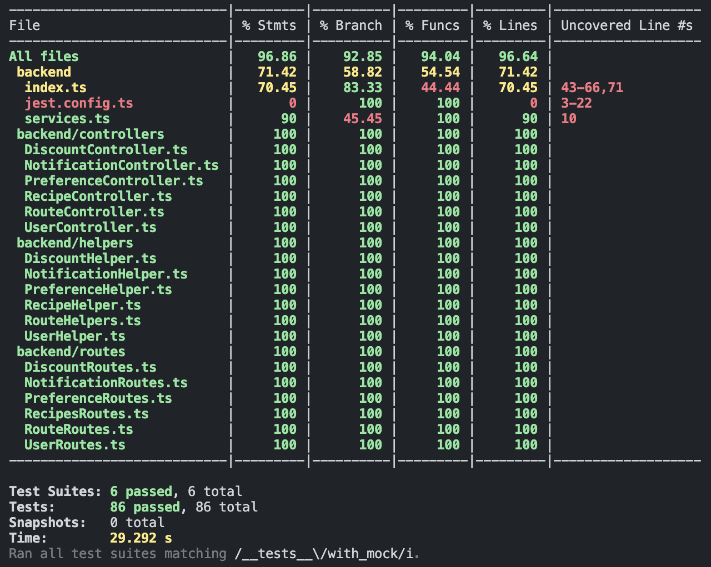
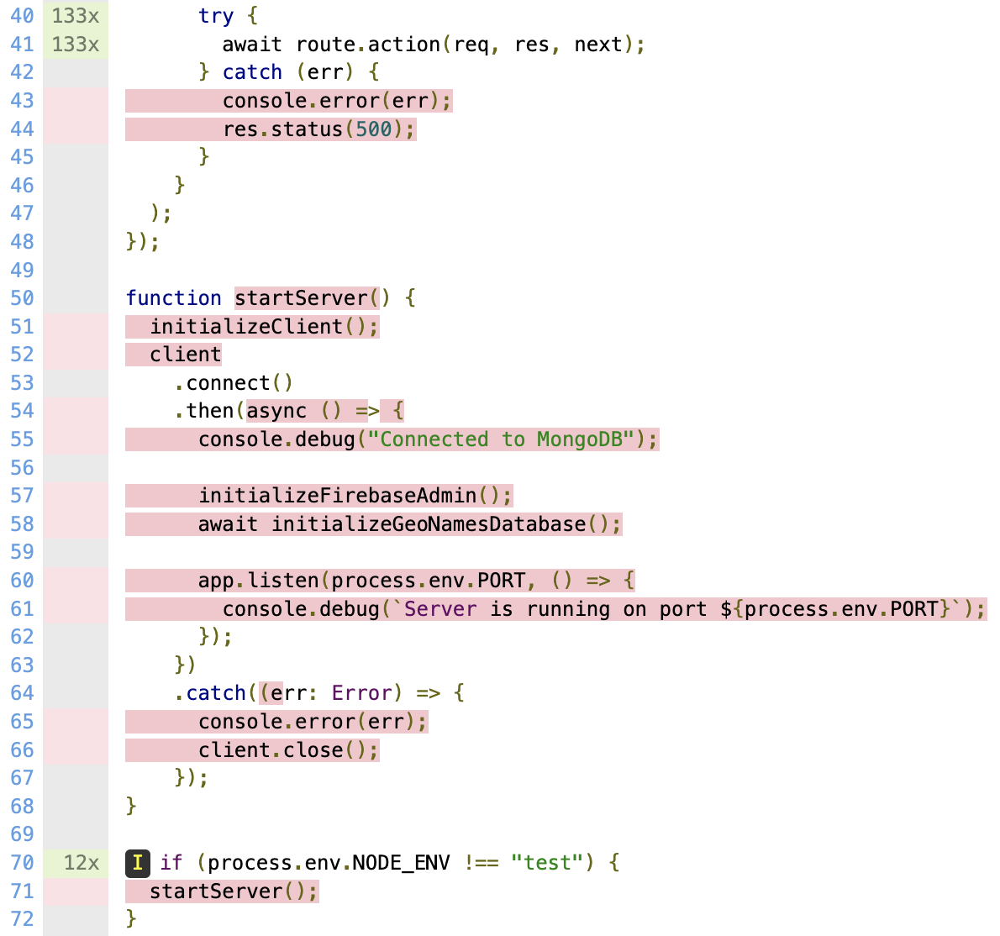
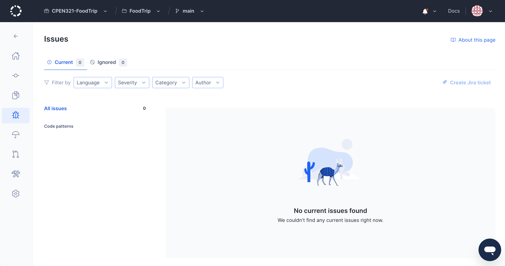

# Example M5: Testing and Code Review

## 1. Change History

| **Change Date**   | **Modified Sections** | **Rationale** |
| ----------------- | --------------------- | ------------- |
| March 30, 2025 | 3.2 | Updated required response time to 3s to match test implementation |
| March 30, 2025 | 2.3 & 2.4 | Updated screenshots of coverage to reflect changes in implementation |
| March 30, 2025 | 5.1 - 5.3 | Updated screenshots of codacy and commit hash where run to reflect changes in implementation |
| March 30, 2025 | 2.1 | Updated links of backend tests and commit hash where run to reflect changes in implementation |
| March 30, 2025 | 3.1 | Updated links of non-functional tests to reflect changes in implementation |
| April 2, 2025 | 3.2 | Update description to mention 2 second response time requirement, update description with justification of 2 seconds and source, and update test logs to match new implementation |
| April 2, 2025 | 5.* | Update codacy screenshots and commit hash to account for code updates |

---

## 2. Back-end Test Specification: APIs

### 2.1. Locations of Back-end Tests and Instructions to Run Them

#### 2.1.1. Tests

| **Interface**                 | **Describe Group Location, No Mocks**                | **Describe Group Location, With Mocks**            | **Mocked Components**              |
| ----------------------------- | ---------------------------------------------------- | -------------------------------------------------- | ---------------------------------- |
| **POST /discounts**    | [`backend/__tests__/no_mock/NoMockDiscount.test.ts#L13`](https://github.com/CPEN321-FoodTrip/FoodTrip/blob/6ccb84af25ae10d9d3649238495f22ded40c3c05/backend/__tests__/no_mock/NoMockDiscount.test.ts#L13) | [`backend/__tests__/with_mock/WithMockDiscount.test.ts#L20`](https://github.com/CPEN321-FoodTrip/FoodTrip/blob/6ccb84af25ae10d9d3649238495f22ded40c3c05/backend/__tests__/with_mock/WithMockDiscount.test.ts#L20) | Discounts DB, Firebase Admin |
|**GET /discounts/:id**  | [`backend/__tests__/no_mock/NoMockDiscount.test.ts#L172`](https://github.com/CPEN321-FoodTrip/FoodTrip/blob/6ccb84af25ae10d9d3649238495f22ded40c3c05/backend/__tests__/no_mock/NoMockDiscount.test.ts#L172) | [`backend/__tests__/with_mock/WithMockDiscount.test.ts#L247`](https://github.com/CPEN321-FoodTrip/FoodTrip/blob/6ccb84af25ae10d9d3649238495f22ded40c3c05/backend/__tests__/with_mock/WithMockDiscount.test.ts#L247) | Discounts DB |
|**GET /discounts** | [`backend/__tests__/no_mock/NoMockDiscount.test.ts#L252`](https://github.com/CPEN321-FoodTrip/FoodTrip/blob/6ccb84af25ae10d9d3649238495f22ded40c3c05/backend/__tests__/no_mock/NoMockDiscount.test.ts#L252) | [`backend/__tests__/with_mock/WithMockDiscount.test.ts#L349`](https://github.com/CPEN321-FoodTrip/FoodTrip/blob/6ccb84af25ae10d9d3649238495f22ded40c3c05/backend/__tests__/with_mock/WithMockDiscount.test.ts#L349) | Discounts DB |
|**DELETE /discounts/:id**| [`backend/__tests__/no_mock/NoMockDiscount.test.ts#L341`](https://github.com/CPEN321-FoodTrip/FoodTrip/blob/6ccb84af25ae10d9d3649238495f22ded40c3c05/backend/__tests__/no_mock/NoMockDiscount.test.ts#L341) | [`backend/__tests__/with_mock/WithMockDiscount.test.ts#L495`](https://github.com/CPEN321-FoodTrip/FoodTrip/blob/6ccb84af25ae10d9d3649238495f22ded40c3c05/backend/__tests__/with_mock/WithMockDiscount.test.ts#L495) | Discounts DB |
|**POST /notifications**| [`backend/__tests__/no_mock/NoMockNotification.test.ts#L10`](https://github.com/CPEN321-FoodTrip/FoodTrip/blob/6ccb84af25ae10d9d3649238495f22ded40c3c05/backend/__tests__/no_mock/NoMockNotification.test.ts#L10) | [`backend/__tests__/with_mock/WithMockNotification.test.ts#L8`](https://github.com/CPEN321-FoodTrip/FoodTrip/blob/6ccb84af25ae10d9d3649238495f22ded40c3c05/backend/__tests__/with_mock/WithMockNotification.test.ts#L8) | Discounts DB |
|**DELETE /notifications/:id**| [`backend/__tests__/no_mock/NoMockNotification.test.ts#L107`](https://github.com/CPEN321-FoodTrip/FoodTrip/blob/6ccb84af25ae10d9d3649238495f22ded40c3c05/backend/__tests__/no_mock/NoMockNotification.test.ts#L107) | [`backend/__tests__/with_mock/WithMockNotification.test.ts#L117`](https://github.com/CPEN321-FoodTrip/FoodTrip/blob/6ccb84af25ae10d9d3649238495f22ded40c3c05/backend/__tests__/with_mock/WithMockNotification.test.ts#L117) |Discounts DB |
|**POST /preferences/allergies**| [`backend/__tests__/no_mock/NoMockPreference.test.ts#L10`](https://github.com/CPEN321-FoodTrip/FoodTrip/blob/6ccb84af25ae10d9d3649238495f22ded40c3c05/backend/__tests__/no_mock/NoMockPreference.test.ts#L10) | [`backend/__tests__/with_mock/WithMockPreference.test.ts#L6`](https://github.com/CPEN321-FoodTrip/FoodTrip/blob/6ccb84af25ae10d9d3649238495f22ded40c3c05/backend/__tests__/with_mock/WithMockPreference.test.ts#L6) | Preferences DB|
|**GET /preferences/allergies/:id**| [`backend/__tests__/no_mock/NoMockPreference.test.ts#L74`](https://github.com/CPEN321-FoodTrip/FoodTrip/blob/6ccb84af25ae10d9d3649238495f22ded40c3c05/backend/__tests__/no_mock/NoMockPreference.test.ts#L74) | [`backend/__tests__/with_mock/WithMockPreference.test.ts#L79`](https://github.com/CPEN321-FoodTrip/FoodTrip/blob/6ccb84af25ae10d9d3649238495f22ded40c3c05/backend/__tests__/with_mock/WithMockPreference.test.ts#L79) |Preferences DB|
|**DELETE /preferences/allergies/:id/:allergy**| [`backend/__tests__/no_mock/NoMockPreference.test.ts#L114`](https://github.com/CPEN321-FoodTrip/FoodTrip/blob/6ccb84af25ae10d9d3649238495f22ded40c3c05/backend/__tests__/no_mock/NoMockPreference.test.ts#L114) | [`backend/__tests__/with_mock/WithMockPreference.test.ts#L164`](https://github.com/CPEN321-FoodTrip/FoodTrip/blob/6ccb84af25ae10d9d3649238495f22ded40c3c05/backend/__tests__/with_mock/WithMockPreference.test.ts#L164) |Preferences DB|
| **POST /recipes**      | [`backend/__tests__/no_mock/NoMockRecipe.test.ts#L171`](https://github.com/CPEN321-FoodTrip/FoodTrip/blob/6ccb84af25ae10d9d3649238495f22ded40c3c05/backend/__tests__/no_mock/NoMockRecipe.test.ts#L171) | [`backend/__tests__/with_mock/WithMockRecipe.test.ts#L323`](https://github.com/CPEN321-FoodTrip/FoodTrip/blob/6ccb84af25ae10d9d3649238495f22ded40c3c05/backend/__tests__/with_mock/WithMockRecipe.test.ts#L323) | Recipes DB, Route Data DB, Preferences DB, Edamam API |
| **GET /recipes/:id**       | [`backend/__tests__/no_mock/NoMockRecipe.test.ts#L423`](https://github.com/CPEN321-FoodTrip/FoodTrip/blob/6ccb84af25ae10d9d3649238495f22ded40c3c05/backend/__tests__/no_mock/NoMockRecipe.test.ts#L423) | [`backend/__tests__/with_mock/WithMockRecipe.test.ts#L625`](https://github.com/CPEN321-FoodTrip/FoodTrip/blob/6ccb84af25ae10d9d3649238495f22ded40c3c05/backend/__tests__/with_mock/WithMockRecipe.test.ts#L625) | Recipes DB
| **DELETE /recipes/:id**    | [`backend/__tests__/no_mock/NoMockRecipe.test.ts#L495`](https://github.com/CPEN321-FoodTrip/FoodTrip/blob/6ccb84af25ae10d9d3649238495f22ded40c3c05/backend/__tests__/no_mock/NoMockRecipe.test.ts#L495) | [`backend/__tests__/with_mock/WithMockRecipe.test.ts#L751`](https://github.com/CPEN321-FoodTrip/FoodTrip/blob/6ccb84af25ae10d9d3649238495f22ded40c3c05/backend/__tests__/with_mock/WithMockRecipe.test.ts#L751) | Recipes DB|
|**POST /routes**        | [`backend/__tests__/no_mock/NoMockRoute.test.ts#L52`](https://github.com/CPEN321-FoodTrip/FoodTrip/blob/6ccb84af25ae10d9d3649238495f22ded40c3c05/backend/__tests__/no_mock/NoMockRoute.test.ts#L52)  | [`backend/__tests__/with_mock/WithMockRoute.test.ts#L30`](https://github.com/CPEN321-FoodTrip/FoodTrip/blob/6ccb84af25ae10d9d3649238495f22ded40c3c05/backend/__tests__/with_mock/WithMockRoute.test.ts#L30) |Route Data DB, Geonames DB, OpenStreetMap API|
|**GET /routes/:id**         | [`backend/__tests__/no_mock/NoMockRoute.test.ts#L341`](https://github.com/CPEN321-FoodTrip/FoodTrip/blob/6ccb84af25ae10d9d3649238495f22ded40c3c05/backend/__tests__/no_mock/NoMockRoute.test.ts#L341) | [`backend/__tests__/with_mock/WithMockRoute.test.ts#L397`](https://github.com/CPEN321-FoodTrip/FoodTrip/blob/6ccb84af25ae10d9d3649238495f22ded40c3c05/backend/__tests__/with_mock/WithMockRoute.test.ts#L397) |Route Data DB|
|**DELETE /routes/:id**      | [`backend/__tests__/no_mock/NoMockRoute.test.ts#L402`](https://github.com/CPEN321-FoodTrip/FoodTrip/blob/6ccb84af25ae10d9d3649238495f22ded40c3c05/backend/__tests__/no_mock/NoMockRoute.test.ts#L402)  | [`backend/__tests__/with_mock/WithMockRoute.test.ts#L490`](https://github.com/CPEN321-FoodTrip/FoodTrip/blob/6ccb84af25ae10d9d3649238495f22ded40c3c05/backend/__tests__/with_mock/WithMockRoute.test.ts#L490) |Route Data DB|
|**GET /users/:userID/routes**| [`backend/__tests__/no_mock/NoMockUser.test.ts#L11`](https://github.com/CPEN321-FoodTrip/FoodTrip/blob/6ccb84af25ae10d9d3649238495f22ded40c3c05/backend/__tests__/no_mock/NoMockUser.test.ts#L11) | [`backend/__tests__/with_mock/WithMockUser.test.ts#L47`](https://github.com/CPEN321-FoodTrip/FoodTrip/blob/6ccb84af25ae10d9d3649238495f22ded40c3c05/backend/__tests__/with_mock/WithMockUser.test.ts#L47) |Route Data DB|

#### 2.1.2. Commit Hash Where Tests Run

`252aa8c8160a75e9a6a253ed465435ff039d71bc`

#### 2.1.3. Explanation on How to Run the Tests

1. **Clone the Repository**:

   - Open your terminal and run:
     ```
     git clone https://github.com/CPEN321-FoodTrip/FoodTrip.git
     ```

2. **Navigate to the backend directory:**

    - In the terminal, run:
    ```
    cd backend/
    ```

3. **Install the required dependencies:**

    - In the terminal, run:
    ```
    npm ci
    ```

4. **Setup a `.env` in the backend directory:**

    - In the terminal, run:
    ```
    touch .env
    ```
    - With the editor of your choice, add the following environment variables:
    ```
    EDAMAM_APP_ID=
    EDAMAM_API_KEY=
    FIREBASE_SERVICE_ACCOUNT_KEY=
    (Optional, only for performance test) GATEWAY_BASE_URL=
    ```

5. **Run the tests with or without coverage:**

    - To run the tests **with** coverage, use the following command in the terminal:

    ```
    npm run test:coverage
    ```

    - To run the tests **without** coverage, use the following command in the terminal:

    ```
    npm run test
    ```

6. **[Optional] Run only the mocked or unmocked tests:**

    - To run the tests **with** mocks, use the following command in the terminal:

    ```
    npm run test __tests__/with_mock/
    ```

    - To run the tests **without** mocks, use the following command in the terminal:

    ```
    npm run test __tests__/no_mock/
    ```

7. **View the full coverage repo:**

    - Within the backend directory navigate to the `coverage/lcov-report` directory.
    - Open `index.html` in the browser.


### 2.2. GitHub Actions Configuration Location

`~/.github/workflows/test-backend.yml`

### 2.3. Jest Coverage Report Screenshots With Mocks



The `index.ts` file does not have 100% coverage because the server does not start or open a port during tests, and a different MongoDB client is used. As a result, the `startServer()` function is not executed.



The reason the `jest.config.ts` file does not have any coverage is simply because it is for configuring our test environment and does not contribute to the functionality of the app.

The `services.ts` file has no coverage because, during testing, an in-memory MongoDB client is injected. As a result, one branch of an if statement, responsible for assigning the production client, is never executed.


### 2.4. Jest Coverage Report Screenshots Without Mocks


The reason for not having 100% coverage on files in the `backend/controllers` and `backend/helpers` directories is because of internal error handling related to database and external api failures which cannot be tested without mocks. Typically, they are handled within try/catch blocks that call `next()` to pass the error to a central error handler or the helper function which is then caught in the controller.

The `index.ts`, `jest.config.ts` and `services.ts` files do not have 100% coverage due to the exact same reasons as the mocked tests.

---

## 3. Back-end Test Specification: Tests of Non-Functional Requirements

### 3.1. Test Locations in Git

| **Non-Functional Requirement**  | **Location in Git**                              |
| ------------------------------- | ------------------------------------------------ |
| **Performance (Response Time)** | [`FoodTrip/backend/__tests__/non_functional_requirements/performance.test.ts`](https://github.com/CPEN321-FoodTrip/FoodTrip/blob/main/backend/__tests__/non_functional_requirements/performance.test.ts) |
| **Usability (Clicks to navigate)**          | [`FoodTrip/frontend/app/src/androidTest/java/com/example/FoodTripFrontend/ExampleInstrumentedTest.kt`](https://github.com/CPEN321-FoodTrip/FoodTrip/blob/6ccb84af25ae10d9d3649238495f22ded40c3c05/frontend/app/src/androidTest/java/com/example/FoodTripFrontend/ExampleInstrumentedTest.kt) |

### 3.2. Test Verification and Logs

- **Performance (Response Time)**

  - **Verification:** This test suite evaluates the performance of critical API endpoints in an unmocked environment, simulating real-world user interactions. It measures execution times for creating and deleting routes, recipes, discounts, notifications, and allergy preferences, ensuring each operation completes within 2 seconds. This is important for maintaining a smooth user experience, preventing delays, and ensuring the system can handle expected traffic. By logging execution times and validating responses, the tests help identify performance isssues and ensure the system is quick enough. 2 seconds was selected as the ideal time based on this report (https://odown.com/blog/what-is-a-good-api-response-time/) which states that for web applications you strive for response times under 2 seconds and for mobile applications, aim for 1-3 seconds.
  - **Log Output**
    ```
    > backend@1.0.0 test
    > NODE_ENV=test jest --testPathPattern=(/non_functional_requirements/)

    console.debug
        Route Execution time: 1865ms

        at __tests__/non_functional_requirements/performance.test.ts:29:15

    console.debug
        Recipe Execution time: 864ms

        at __tests__/non_functional_requirements/performance.test.ts:52:15

    console.debug
        Route Teardown Execution time: 62ms

        at __tests__/non_functional_requirements/performance.test.ts:76:15

    console.debug
        Recipe Teardown Execution time: 85ms

        at __tests__/non_functional_requirements/performance.test.ts:96:15

    console.debug
        Add Discount Execution time: 301ms

        at __tests__/non_functional_requirements/performance.test.ts:125:13

    console.debug
        Get Discount Execution time: 88ms

        at __tests__/non_functional_requirements/performance.test.ts:144:13

    console.debug
        Delete Discount Execution time: 85ms

        at __tests__/non_functional_requirements/performance.test.ts:165:13

    console.debug
        Add 10 Discounts Average Execution time: 191.5ms

        at __tests__/non_functional_requirements/performance.test.ts:205:13

    console.debug
        Get All Discounts Execution time: 76ms

        at __tests__/non_functional_requirements/performance.test.ts:228:13

    console.debug
        Delete 10 Discounts Average Execution time: 52.4ms

        at __tests__/non_functional_requirements/performance.test.ts:260:13

    console.debug
        Add Notification Execution time: 34ms

        at __tests__/non_functional_requirements/performance.test.ts:287:13

    console.debug
        Delete Notification Execution time: 31ms

        at __tests__/non_functional_requirements/performance.test.ts:313:13

    console.debug
        Add 10 Notifications Average Execution time: 45.6ms

        at __tests__/non_functional_requirements/performance.test.ts:348:13

    console.debug
        Delete 10 Notifications Average Execution time: 41.5ms

        at __tests__/non_functional_requirements/performance.test.ts:383:13

    console.debug
        Add Allergy Execution time: 85ms

        at __tests__/non_functional_requirements/performance.test.ts:412:13

    console.debug
        Get Allergy Execution time: 33ms

        at __tests__/non_functional_requirements/performance.test.ts:431:13

    console.debug
        Delete Allergy Execution time: 68ms

        at __tests__/non_functional_requirements/performance.test.ts:456:13

    PASS __tests__/non_functional_requirements/performance.test.ts (11.024 s)
    Performance test
        ✓ Single route, 3 stops (2911 ms)
        ✓ Single discount (482 ms)
        ✓ 10 discount (2527 ms)
        ✓ Single notification (70 ms)
        ✓ 10 notification (878 ms)
        ✓ Single allergy (192 ms)

    Test Suites: 1 passed, 1 total
    Tests:       6 passed, 6 total
    Snapshots:   0 total
    Time:        11.064 s
    Ran all test suites matching /(\/non_functional_requirements\/)/i.
    ```

- **Usability (Clicks to Navigate)**
  - **Verification:** This test suite simulates using the frontend app along with Espresso to mimic a user's behavior. The test is done by counting the number of valid click in a use case test. At the end of the test, it checks the number of clicks performed in the test. If the number of clicks is within 3 clicks, it passes, and vice versa.
  - **Log Output**
    ```
    Usability Test Passed(0 clicks): GroceryActivityTest:checkElements
    Usability Test Passed(1 clicks): GroceryActivityTest:discountSuccessTest
    Usability Test Passed(1 clicks): GroceryActivityTest:backButton
    Usability Test Passed(1 clicks): GroceryActivityTest:discountEmptyTest
    Usability Test Passed(0 clicks): GroceryStoreActivityTest:checkElements
    Usability Test Passed(1 clicks): GroceryStoreActivityTest:backButtonTest
    Usability Test Passed(1 clicks): GroceryStoreActivityTest:emptyIngredientTest
    Usability Test Passed(3 clicks): GroceryStoreActivityTest:postAndDeleteDiscountTest
    Usability Test Passed(1 clicks): GroceryStoreActivityTest:zeroPriceTest
    Usability Test Passed(1 clicks): GroceryStoreActivityTest:emptyPriceTest
    Usability Test Failed(7 clicks): GroceryStoreActivityTest:deleteTest
    Usability Test Failed(7 clicks): GroceryStoreActivityTest:changeSelectedTest
    Usability Test Passed(0 clicks): LoginActivityTest:checkElements
    Usability Test Passed(1 clicks): MainActivityAdminTest:setGroceriesButton
    Usability Test Passed(0 clicks): MainActivityTest:checkElements
    Usability Test Passed(1 clicks): MainActivityTest:checkAccount
    Usability Test Passed(1 clicks): MainActivityTest:checkViewRecipe
    Usability Test Passed(1 clicks): MainActivityTest:checkManageTrip
    Usability Test Passed(1 clicks): MainActivityTest:checkPastTrips
    Usability Test Passed(1 clicks): MainActivityTest:signOut
    Usability Test Passed(0 clicks): PastTripActivityEmptyTest:checkElements
    Usability Test Passed(0 clicks): PastTripActivityEmptyTest:emptyPastTrip
    Usability Test Passed(1 clicks): PastTripActivityEmptyTest:backButton
    Usability Test Passed(0 clicks): PastTripActivityTestPersonTest:checkElements
    Usability Test Passed(3 clicks): PastTripActivityTestPersonTest:GeneralRecipeViewPastTrip
    Usability Test Passed(1 clicks): PastTripActivityTestPersonTest:backButton
    Usability Test Passed(3 clicks): RecipeTests:displayRecipe
    Usability Test Passed(1 clicks): TripActivityTest:wrongEnd
    Usability Test Passed(1 clicks): TripActivityTest:planRegularTripShort
    Usability Test Passed(1 clicks): TripActivityTest:sameStartEnd
    Usability Test Passed(1 clicks): TripActivityTest:missingInputsEnd
    Usability Test Passed(1 clicks): TripActivityTest:wrongStart
    Usability Test Passed(1 clicks): TripActivityTest:missingInputsStart
    Usability Test Passed(1 clicks): TripActivityTest:missingInputsStops
    Usability Test Passed(1 clicks): TripActivityTest:wrongStopsAmount

    ```

---

## 4. Front-end Test Specification

### 4.1. Location in Git of Front-end Test Suite:

`frontend/app/src/androidTest/java/com/example/FoodTripFrontend/ExampleInstrumentedTest.kt`
### 4.2. Tests


- **Use Case: View Past Trips**
    **Main Success Scenario:**
    1. The user opens "Past Trip" screen.
    2. The app shows a list of "past trip" text view, and a "Back" button.
    3. The user clicks on any past trip.
    4. A window pops up
    5. The window shows the starting location, intermediate stops, destination, recipes for each stop, and a "Show Route" button.
    6. The user presses the "Show Route" button
    7. The user clicks on the first recipe

    **Extensions:**
    * 6a. The user is directed to the main page and a map of the route is displayed
    * 7a. The window shows the details of the recipe and a recipe url
        * 7a1. The user clicks the recipe url.
        * 7a2. A webView shows up.

    **Failure Scenarios:**
    * 2a. The user has no past trip record
        * 2a1. The app shows no items in the list
    * 2b. No internet connection
        * 2b1. The app displays an error message: "No internet connection"

    **Expected Behaviors:**

    | **Scenario Steps** | **Test Case Steps** |
    | ------------------ | ------------------- |
    | 1. User opens the view past trip. | Open Past Trip screen. |
    | 2. The app shows a list of past trip and a "Back" button. | Check the list is present on screen. <br> Check the button is present on screen. |
    | 2a. The user has no past trip record | / |
    | 2a1. The app shows no items in the list | Check no items are present in the list on screen |
    | 3. The user click on any past trip. | Click any past trip text view |
    | 4. A window pops up. | Check the window activity is present on screen. |
    | 5. The window shows the starting location, intermediate stops, destination, recipes for each stop, and a "Show Route" button | Check first recipe is present on screen. |
    | 6. The user presses the show route button| Click on the show route button|
    | 6a. The user is directed to the main page and a map of the route is displayed| Check that the activity has switched to the Main Activity screen and check that the map is now displayed and visible on the screen|
    | 7. The user clicks on the first recipe| Click on the first recipe|
    | 7a. The window shows the details of the recipe and a recipe url| Check that the recipe text is displayed|
    | 7a1. The user clicks the recipe url| Click on the url text view|
    | 7a2. A webView of the recipe shows up| Check that the webView is now displayed|


  - **Test Logs:**
    ```
    com.example.FoodTripFrontend.PastTripActivityEmptyTest
        4.77s passed checkElements
        3.48s passed emptyPastTrip
        8.47s passed backButton
    com.example.FoodTripFrontend.PastTripActivityTestPersonTest
        6.84s  passed checkElements
        30.03s failed GeneralRecipeViewPastTrip
        12.57s passed backButton
    ```
- **Use Case: Manage Trip**

    **Main Success Scenario:**
    1. User Opens the Manage Trip screen
    2. The app shows three text input fields and a Create Trip button
    3. The user enters a starting city, ending city, and the number of desired stops, then presses the Create Trip button
    4. The app opens the Main Screen
    5. A google map is displayed showing the created route from the start to end city

    **Failure Scenarios:**
    * 3a. The user enters an invalid start/end city or an invalid number of stops and attempts to create a trip
        * 3a1. The app displays a pop-up saying that the associated field is invalid
    * 3b. The user doesn't enter a input into any one of the text inputs and attempts to create a trip
        * 3b1. The app displays a pop-up saying that the associated field is missing
    * 3c. The user enters the same city in the start and end fields and attempts to create a trip
        * 3c1. The app displays a pop-up saying that there can't be the same start and end city


   **Expected Behaviors:**

    | **Scenario Steps** | **Test Case Steps** |
    | ------------------ | ------------------- |
    | 1. User Opens the Manage Trip screen| Open Manage Trip screen|
    | 2. The app shows three text input fields and a Create Trip button|Check that there are three text input fields labeled Start City, End City, and Number of Stops and check that there is  button with text Create Trip|
    | 3. The user enters a starting city, ending city, and the number of desired stops, then presses the Create Trip button| Input "Calgary" into the start city text field, "New York" into the end city text field, and "3" into the number of stops, then press the Create Trip button |
    | 3a. The user enters an invalid start/end city or an invalid number of stops and attempts to create a trip| Input adjfiolej as the start/end city or enter 0 as the number of stops, then click Create Trip button|
    | 3a1. The app displays a pop-up saying that the associated field is invalid| Check that a textfield is displayed with the text "Invalid Start City", "Invalid End City", or "Invalid Number of Stops"|
    | 3b. The user doesn't enter a input into any one of the text inputs and attempts to create a trip| Input a correct value (A real city or a number greater than or equal to 1) into two of the three text input fields and then click Create Trip Button|
    | 3b1. The app displays a pop-up saying that the associated field is missing| Check that a textfield is displayed with the text "Missing Start City", "Missing End City", or "Missing Number of Stops"|
    | 3c. The user enters the same city in the start and end fields and attempts to create a trip| Input "New York" into both the start and end city text fields and input 3 into the number of stop field. Press the Create Trip button|
    | 3c1. The app displays a pop-up saying that there can't be the same start and end city| Check that a textfield is displayed with the text "Same Start and End City"|
    | 4. The app opens the Main Screen| Check that the activity has switched to the Main Activity screen|
    | 5. A google map is displayed showing the created route from the start to end city| Check that the map is displayed and visible on the screen|


  - **Test Logs:**
    ```
    com.example.FoodTripFrontend.TripActivityTest
        22.12s failed wrongEnd
        27.81s passed planRegularTripShort
        17.09s failed sameStartEnd
        15.52s failed missingInputsEnd
        15.48s passed wrongStart
        12.29s failed missingInputsStart
        13.37s failed missingInputsStops
        16.49s failed wrongStopsAmount
    ```

- **Use Case: Manage Discounts**
    **Main Success Scenario:**
    1. The admin opens "Grocery Store" screen.
    2. The app shows a list of discounts, an ingredient input text field, a price input text field, a "Delete" button, and a "Post" button.
    3. The admin inputs a new ingredient and the price.
    4. The admin presses the "Post" button.
    5. The screen refreshes and the new discount is added into the list.

    **Extensions:**
    * 3a. The admin presses on a discount in the list.
        * 3a1. The admin presses the "Delete" button.
        * 3a2. The screen refreshes and the selected discount is removed.

    **Failure Scenarios**
    * 3ai. The admin doesn't select a discount to delete.
        * 3ai(1). The app display an error message prompting the admin to select the discount to be deleted
    * 3b. The admin doesn't enter an input into any one of the text input fields and attempts to post a discount.
        * 3b1. The app displays an error message prompting the admin for the valid input.
    * 3c. The admin enter 0 as the price and attempts to post a discount.
        * 3c1. The app displays an error message prompting the admin for the valid input.

  **Expected Behaviors:**

    | **Scenario Steps** | **Test Case Steps** |
    | ------------------ | ------------------- |
    | 1. Admin opens "Grocery Store" screen. | Open Grocery Store screen. |
    | 2. The app shows a list of discounts, an ingredient input text field, a price input text field, a "Delete" button, and a "Post" button. | Check the list is present on screen. <br> Check the ingredient input text view is present on screen. <br> Check the price input text view is present on screen. <br> Check the delete button is present on screen. <br> Check the post button is present on screen. |
    | 3. Admin inputs a new ingredient and price | Input "snack" for the ingredient. <br> Input "10" for the price |
    | 3a. Admin presses on a discount in the list. | Press a discount on the list. |
    | 3ai. Admin doesn't select a discount to delete | Press button labelled "Delete" |
    | 3ai(1). The app display an error message prompting the admin to select the discount to be deleted. | Check dialog is opened with text: "Please select discount to be deleted" |
    | 3b. Admin doesn't enter an input into any one of the text input fields and attempts to post a discount. | Input "snack" for ingredient or input "10" for price. <br> Press the "Post" button" |
    | 3b1.The app displays an error message prompting the admin for a valid input. | Check dialog is opened with text: "Please enter valid ingredient and price" |
    | 3c. Admin input enter 0 as the price and attempts to post a discount. | Input "snack" for ingredient <br> Input "0" for price <br> Press the "Post" button |
    | 3c1. The app displays an error message prompting the admin for a valid input. | Check dialog is opened with text: "Please enter valid ingredient and price" |
    | 4. Admin presses the "Post" button | Press the button labelled "Post" |
    | 5. The screen refreshes and the new discount is added into the list | Check textView with text "snack: $10" is present on screen. |


  - **Test Logs:**
    ```
    com.example.FoodTripFrontend.GroceryStoreActivityTest
    10.67s passed checkElements
    23.75s failed backButtonTest
    19.48s passed emptyIngredientTest
    59.08s passed postAndDeleteDiscountTest
    21.38s passed zeroPriceTest
    15.42s passed emptyPriceTest
    22.86s passed deleteTest
    26.65s passed changeSelectedTest

---

## 5. Automated Code Review Results

### 5.1. Commit Hash Where Codacy Ran

`c4af1f3921930b82a3fe69d18c0ba64f4b2c03f4`

### 5.2. Unfixed Issues per Codacy Category


### 5.3. Unfixed Issues per Codacy Code Pattern


